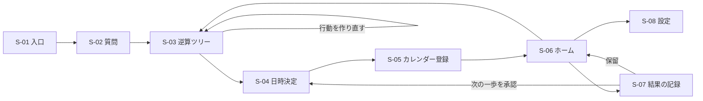
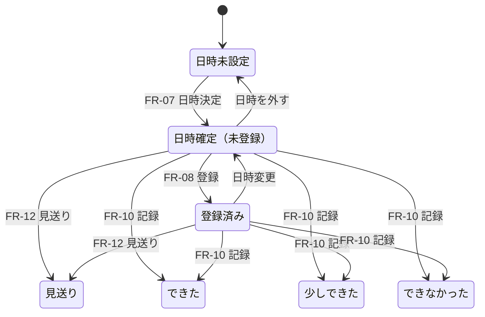

# リザーブマシン 要件定義書 v0.2 — メンバーB案

| 項目 | 内容 |
| --- | --- |
| チーム | AIハッカソン・チーム15 |
| 作成日 | 2026年9月13日（v0.1）／更新：2026年9月13日（v0.2） |
| 位置付け | 個人案。チームの正式仕様ではない。統合会議で `mvp-spec.md` を作る材料 |
| 想定 | 3人で開発するスマホ対応Webアプリ。時間は `mvp-proposal.md` の「残り2時間30分」を基準にし、4時間版も併記する（第18.3節・第19章）。使用技術は統合時に決定する |
| v0.2での変更 | 章番号が変わった。v0.1の章番号で引用している場合は第24.2節の対応表を参照。企画メモから要件定義書に書き直し。機能要件ID・画面要件・AI入出力・データ定義・Googleカレンダー連携・非機能要件・受入テスト・削り順・未検証事項を追加。C案との関係を追記 |

本書の記号：

- **FR**＝機能要件、**NFR**＝非機能要件、**S**＝画面、**AI**＝AI呼び出し、**TC**＝受入テスト、**Q**＝未決・未検証事項
- 優先度は **Must**（ないとデモが成立しない）／**Should**（時間があれば入れる）／**Could**（余裕があれば）／**Won't**（今回作らない）
- 本書に書いた人物・金額・日時はすべて架空のデモ用。統計の数値は書かない（第11章）

---

## 1. 目的と背景

### 1.1 一文で

**曖昧な願いを、今日の予定に変える。**

「お金持ちになりたい」「なんか、このままじゃまずい気がする」のような、まだ形になっていない願いを受け取り、本人への質問と統計の参照値から「目指す状態 → 必要な数字 → 月の行動 → 今週の行動」まで逆算し、Googleカレンダーに予定として入れる。予定の結果を記録すると、次の一歩が提案される。

### 1.2 背景（ハッカソンの課題設定）

- 10年後、AIが仕事の多くを担い、人の自由な時間が増える。これは予測の断定ではなく、お題「10年後のあたりまえ」に対する課題設定である。
- 仕事は、予定・役割・目標を外から与えてくれていた。それがなくなると、願いがあっても曖昧なまま止まり、予定にならずに時間が流れる。
- 本案が作る10年後のあたりまえは、**「曖昧な願いを口にしたら、今週やることがカレンダーに入っている」**こと。

### 1.3 判断基準と表現の方針

- 機能の判断基準は「この人の曖昧な願いが、今日の予定になったか」。
- 行動量・達成度・継続日数で人の価値を測らない。休む選択も予定として扱う。
- 「不要」「堕落」「怠け」など人を評価する言葉は、画面・AI出力・発表資料・動画のいずれにも使わない（第13章）。

### 1.4 一般的なAIチャットとの違い

| 違い | 内容 | 対応する要件 |
| --- | --- | --- |
| 聞かれる前に聞く | 本人が自分では答えを持っていない前提（望む生活の月額、使える時間、許容できる負担）をAIが先に質問する | FR-02 |
| 主観を数字に変える | 「ゆとり」「人に見せられる何か」を数字や状態に翻訳し、その数字が本人の回答・統計・AIの推定のどれかを表示する。計算はコードで行う | FR-03〜05 |
| 予定が外に出て、結果が戻る | 行動がGoogleカレンダーに入り、完了の記録がアプリに戻って次の一歩になる | FR-08〜11 |

特定のAI製品で同じことが不可能だとは主張しない。比較対象は単発の会話体験。

---

## 2. スコープ

### 2.1 今回作るもの（MVP）

1. 願いの入力と、逆算に必要な質問（最大5問）
2. 逆算ツリーの生成と表示（願い → 目指す状態 → 数字 → 月の行動 → 今週の行動）
3. 数字の計算（コード）と出どころの表示
4. 今週の行動（最大3件）の日時決定
5. Googleカレンダーへの登録
6. 結果の記録と、次の一歩の提案・承認
7. 端末内への保存と復元

### 2.2 今回作らないもの（Won't）

| 項目 | 理由 | 置き場所 |
| --- | --- | --- |
| 位置情報・スマホ使用時間・アプリ利用状況による完了の自動判定 | 端末権限と審査対応が必要で、時間内に動かない | 展開性 第2段階 |
| 複数利用者の記録からの最短ルート推薦 | 利用者の蓄積と同意設計が必要 | 展開性 第3段階 |
| Googleカレンダーの空き時間の読み取り | 読み取り権限の追加が必要。登録だけに絞る | Q-05 |
| 複数の願いの同時管理、長期の分析、通知、継続チャット | 中心の一巡に必要ない | 将来 |
| 店舗・教室の実予約、決済、他人への招待 | 実在施設の情報を扱わない方針 | 将来 |
| 投資商品の推奨・利回りを使った計算 | 投資助言に当たるおそれがある | 対象外 |
| アカウント、クラウド保存、端末間同期 | 認証と保存の実装が増える | 将来 |

---

## 3. 用語

| 用語 | 定義 |
| --- | --- |
| 願い | 本人が最初に入力する自由文。曖昧でよい |
| 逆算ツリー | 願いを「目指す状態 → 数字 → 月の行動 → 今週の行動」に分解した木構造 |
| 目指す状態 | 期限つきの到達イメージ（例：2027年9月までに、人に見せられる作品を1つ持つ） |
| 数字 | 目指す状態に必要な量。金額・回数・時間のいずれか |
| 出どころ | 数字や前提の根拠。「本人の回答」「統計の参照値」「AIの推定」の3種類 |
| 仮置き | 本人が「分からない」と答えた項目に、参照値または推定を入れた状態。画面に「仮」と表示する |
| 行動 | カレンダーに入れる単位。内容・所要時間・準備・気が重いときの代替案を持つ |
| 登録 | 行動をGoogleカレンダーに入れること。店舗や相手への予約ではない |
| 記録 | 行動の結果（できた／少しできた／できなかった）と任意の気持ち |
| 次の一歩 | 記録をもとにAIが出す次の行動案1件。本人が承認するまで何も変わらない |

---

## 4. 対象者

### 4.1 中心ペルソナ

**けんたさん、32歳（架空）**

| 項目 | 設定 |
| --- | --- |
| 仕事 | 事務職。資料作成と集計はAIが担うようになり、残業がほぼなくなった |
| 生活 | 平日は19時に帰宅し、SNSと動画を見て寝る。休日は予定がなく、スマホを長時間見ている |
| お金 | 手取り22万円、貯金60万円。家計簿アプリを入れては続かなかった |
| 本音 | 「なんか、このままじゃまずい気がする。何かしたい。でも何を？」 |
| 止まっている理由 | 願いが曖昧で最初の一歩が決まらない。決めても予定にならず流れる |
| 使う場面 | 日曜の夜、スマホを置いたとき。所要5分で今週の予定を入れたい |
| ITの前提 | スマホでWebとGoogleカレンダーを使える。ファイルの書き出しなど技術的な操作は前提にしない |

### 4.2 同じ仕組みで扱う願いの種類

対象者は絞り、願いの幅で広げる。MVPで数字の計算を用意するのは次の2種類。

| 種類 | 例 | 数字の型 |
| --- | --- | --- |
| お金 | お金持ちになりたい、老後が不安 | 貯蓄目標型（第10.3節） |
| 活動 | 何かしたい、人に見せられる何かを持ちたい、英語を話したい | 頻度型（第10.3節） |
| 分からない | まだ分からない | 最初の行動を「願いを具体化する」にする |

### 4.3 対象外

- 医療・心理的な支援を必要としている人への診断や治療（第13.3節で相談先を案内する）
- 投資判断の相談

---

## 5. 利用シナリオ

### UC-01 曖昧な願いから今週の予定を入れる（中心）

1. けんたさんが入口で「なんか、このままじゃまずい気がする。何かしたい」と入力する。
2. アプリが最大5問を出す（例：休日に使える時間、人と会うのは平気か、月に使える費用、体を動かすのは好きか）。
3. 回答すると逆算ツリーが出る。例：「2027年9月までに人に見せられる作品を1つ持つ → 月2回・1回3時間 → 今月：体験教室を1回、道具を調べる → 今週：土曜10時に陶芸体験の空きを調べる（30分）」。
4. 今週の行動の日時候補から選んで確定する。
5. Googleカレンダーに登録され、アプリにカレンダーへのリンクが出る。

### UC-02 お金の願いを数字にする

1. 「お金持ちになりたい」と入力する。
2. 質問：望む生活の月額、現在の貯金、目標の時期、毎月の手取り。
3. 本人が「望む生活の月額：分からない」と答えた場合、統計の参照値で仮置きし「仮・統計の参照値」と表示する。
4. 数字はコードで計算する（例：望む月額20万円 × 24ヶ月分 ＝ 480万円、貯金60万円、期限まで156ヶ月 → 月2.7万円）。
5. 今週の行動は「固定費を書き出す（20分）」など、計画の整理にとどめる。投資商品は出さない。

### UC-03 結果を記録して次の一歩を決める

1. 予定の終了時刻を過ぎると、ホームのその行動が「確認待ち」になる。
2. 「できた・楽しかった」を記録すると、ツリーの今月の行動の進み具合が更新される。
3. AIが次の一歩を1件出す（例：「来週の土曜に体験教室を申し込む」）。
4. 承認すると日時決定へ進み、カレンダーに登録される。保留すると何も変わらない。

### UC-04 できなかった後も続ける

1. 「できなかった・しんどかった」を記録する。
2. AIが負担を小さくする案（「教室のサイトを5分だけ見る」）か、休む案を出す。
3. 承認した場合だけ予定になる。記録は消えない。

### UC-05 目指す状態を自分で直す

1. 逆算ツリーで期限を「2027年9月」から「2028年3月」に変える。
2. 数字（月あたりの回数や積立額）がその場で再計算される。
3. 月の行動と今週の行動は自動で変えず、「行動を作り直す」を押したときだけAIが作り直す。

### UC-06 再訪する

1. アプリを開くと保存されたホームが出る。次の予定・今週の行動・ツリーの進み具合が見える。

### UC-07 データを消す

1. 設定から「すべての記録を削除」を選び、確認画面で承認するとローカルの記録が消える。Googleカレンダーの予定は消えないことを確認画面に書く。

---

## 6. 画面遷移



- 保存済みのデータがあれば、起動時は S-06 ホームを開く。なければ S-01 入口。
- どの画面でもブラウザの戻る操作で入力が消えないようにする（NFR-07）。

---

## 7. 機能要件

各要件の書き方：内容／入力／処理／出力／受入基準／優先度。

### FR-01 願いの入力 【Must】

- 内容：自由文で願いを入力する。「まだ分からない」ボタンでも進める。
- 入力：願い（1〜200文字）。
- 処理：前後の空白を除く。空欄で「次へ」は押せない。「まだ分からない」の場合は願いを「まだ分からない」として保存し、種類を「分からない」にする。
- 出力：AI-01 の呼び出し。
- 受入基準：TC-01、TC-02。

### FR-02 逆算のための質問 【Must】

- 内容：願いに応じて、逆算に必要な質問を最大5問出す。
- 処理：
  - AI-01 が願いの種類（お金／活動／分からない）と質問を返す。
  - 質問は選択肢形式を基本とし、必ず「分からない」を含む。数値の質問は数値入力と「分からない」の併用。
  - 必須質問はアプリ側で固定する。種類がお金なら「現在の貯金」「目標の時期」、活動なら「使える曜日と時間帯」。AIが出さなかった場合もアプリが末尾に足す。ただし合計は最大6問とする。
  - 「使える曜日と時間帯」は全種類で必ず聞く（FR-07 の日時候補に使う）。
- 出力：回答一覧。「分からない」の項目は仮置きの対象になる。
- 受入基準：TC-03、TC-04。

### FR-03 逆算ツリーの生成 【Must】

- 内容：願いと回答から逆算ツリーを作る。
- 処理：
  - AI-02 を呼ぶ。AIが返すのは構造と言葉（目指す状態、数字の型と入力値の案、月の行動、今週の行動）。
  - 数字の計算結果はAIに出させない。FR-04 のコードで計算する。
  - 今週の行動は最大3件。4件以上返った場合は先頭3件だけ使う。0件なら形式不正として扱う（FR-14）。
- 出力：S-03 に表示するツリー。
- 受入基準：TC-05、TC-06。

### FR-04 数字の計算 【Must】

- 内容：数字の型ごとに、決まった計算式で結果を出す（計算式は第10.3節）。
- 処理：入力値が欠けている場合は計算せず「入力が必要」と表示する。0以下・期限切れなど不正な値は計算せず理由を表示する。
- 出力：数字の結果と、計算式を人が読める1行（例：「(480万円 − 60万円) ÷ 156ヶ月 ＝ 月2.7万円」）。
- 受入基準：TC-07。

### FR-05 出どころの表示 【Must】

- 内容：数字とその入力値ごとに出どころを表示する。
- 処理：
  - 「本人の回答」：回答を使った値。
  - 「統計の参照値」：アプリ内の統計データ（第11章）にある項目IDを参照した値。調査名・年・対象を表示し、一次資料へのリンクを付ける。
  - 「AIの推定」：上記以外。
  - AIが統計を名乗っても、指定した項目IDがアプリ内に存在しない場合は「AIの推定」に格下げする。
  - 仮置きの値には「仮」を付ける。
- 受入基準：TC-08。

### FR-06 ツリーの編集と再計算 【Should】

- 内容：目指す状態の文言・期限、数字の入力値を本人が編集できる。
- 処理：
  - 数字の入力値や期限を変えたら、FR-04 で即時に再計算する。編集した値の出どころは「本人の回答」に変わり、「仮」が外れる。
  - 月の行動・今週の行動は自動で変えない。「行動を作り直す」を押したときだけ AI-02 を再度呼ぶ。
  - 作り直す前に「日時を決めていない行動だけが置き換わる。登録済みの行動は残る」と確認する。
  - 作り直しに失敗した場合、元のツリーを残す。
- 受入基準：TC-09、TC-10。

### FR-07 日時の決定 【Must】

- 内容：今週の行動ごとに日時を決める。
- 処理（日時候補はコードで作る。AIは使わない）：
  - 範囲：現在時刻の1時間後から7日後まで。
  - 使える時間帯（FR-02 の回答）に収まる枠から、開始を00分か30分にそろえて候補を作る。
  - アプリ内の他の行動と重なる候補は出さない。
  - 1件につき候補を3つ出す。可能なら別々の日にする。
  - 所要時間が時間帯に収まらない、または候補が0件の場合は「手入力」を開く。
  - 手入力でも、過去の日時とアプリ内の予定と重なる日時は確定できない（重なりは警告を出し、「それでも確定」で確定可）。
  - 日時を決めない行動は「日時未設定」として残せる。
- 出力：行動の開始・終了日時（日本時間）。
- 受入基準：TC-11、TC-12、TC-13。

### FR-08 Googleカレンダーへの登録 【Must（テンプレートURL）／Should（API）】

- 内容：日時を確定した行動をGoogleカレンダーに登録する。登録方法は3つ用意し、画面では上から順に出す。
- 方法A：Google Calendar API（Should）
  - 本人がGoogleでログインして許可すると、APIで予定を作る。詳細は第12.1節。
  - 成功したら予定のIDとリンクを保存し、状態を「登録済み」にする。
- 方法B：テンプレートURL（Must）
  - 予定の内容を埋め込んだGoogleカレンダーの予定作成画面を新しいタブで開く。詳細は第12.2節。
  - 本人がカレンダー側で保存したあと、アプリに戻って「カレンダーに保存した」を押すと「登録済み」にする。押すまでは「日時確定（未登録）」のまま。
- 方法C：.ics ファイル（Could）
  - 予定ファイルを出力する。本人が取り込んだあと「カレンダーに保存した」を押す。
- 共通：
  - 予定のタイトルは「【リザーブマシン】行動名」。
  - 説明欄に「願い」「今回の一歩」「準備」「気が重いときは」「アプリのURL」を書く。カレンダーだけを見ても動けるようにする。
  - 実際に登録を確認していない行動を「登録済み」と表示しない。
- 受入基準：TC-14、TC-15、TC-16。

### FR-09 ホーム 【Must】

- 内容：次の予定、今週の行動、ツリーの進み具合を1画面で見せる。
- 表示ルール：
  - 最上部に「次の予定」（開始時刻が最も近い未来の行動）。なければ「今週の予定はまだありません」と「日時を決める」ボタン。
  - 今週の行動は開始日時の順。日時未設定は下にまとめる。
  - 終了時刻を過ぎて結果が未記録の行動は「確認待ち」と表示する。自動で「できなかった」にしない。
  - 進み具合は「今月の行動 2/4回」のように回数で出す。願いの達成率や点数には換算しない。
- 受入基準：TC-17、TC-18。

### FR-10 結果の記録 【Must】

- 内容：行動ごとに結果と気持ちを記録する。
- 入力：
  - 結果（必須）：できた／少しできた／できなかった
  - 気持ち（任意）：楽しかった／ふつう／しんどかった／回答しない
  - ひとこと（任意）：100文字まで
- 処理：
  - 開始時刻より前は結果を記録できない（「日時変更」と「見送り」は可能）。
  - 記録を先に保存してから AI-03 を呼ぶ。AIが失敗しても記録は残る。
  - 同じ行動への二重記録を防ぐ。記録済みの行動は「記録を直す」で上書きでき、直前の値は履歴に残す。
- 受入基準：TC-19、TC-20。

### FR-11 次の一歩の提案と承認 【Must】

- 内容：記録をもとに次の行動案を1件出し、本人が決める。
- 処理：
  - AI-03 が案を1件返す。案の種類は「次へ進む」「小さくする」「日を変える」「休む」のいずれか。
  - 結果が「できなかった」または気持ちが「しんどかった」の場合、「次へ進む」は返させない（プロンプトで指示し、返ってきたらアプリ側で「小さくする」として扱い直す）。
  - 本人の操作は「承認」「保留」「別の案を見る（1回まで）」。
  - 承認すると新しい行動として追加し、FR-07 の日時決定へ進む。今週の行動が3件ある場合は、日時未設定か未記録の行動から置き換える対象を選ばせる。
  - 承認前は、行動・日時・カレンダーのどれも変えない。
  - 「休む」を承認した場合も、休む時間を行動として登録できる（登録しない選択も可）。
- 受入基準：TC-21、TC-22、TC-23。

### FR-12 日時変更と見送り 【Should】

- 内容：行動の日時を変える、または見送る。
- 処理：
  - 日時変更は FR-07 を再度通す。方法Aで登録済みなら、同じ予定を更新する。方法B・Cで登録済みなら「カレンダー側の予定も変更してください」と表示し、再登録を促す。
  - 見送りは状態を「見送り」にする。方法Aで登録済みの場合は「カレンダーの予定も削除しますか」と聞き、承認した場合だけ削除する。
  - 変更前の日時は履歴に残す。
- 受入基準：TC-24。

### FR-13 保存と復元 【Must】

- 内容：すべての状態をブラウザのローカル保存領域に保存し、再読み込みで復元する。
- 処理：
  - 状態が変わるたびに保存する。保存形式は第10章。
  - 保存に失敗したら画面上部に「この端末に保存できませんでした」と表示し、画面上の入力は残す。
  - 読み込んだデータの形式バージョンが合わない、または壊れている場合は、そのデータを上書きせず「データを読み込めませんでした。最初からやり直すか、削除してください」と表示する。
- 受入基準：TC-25。

### FR-14 AIの失敗時の動作 【Must】

- 内容：AIの呼び出しが失敗しても、入力を失わず再試行できる。
- 処理：
  - 生成中は処理中の表示を出し、送信ボタンを無効にする。
  - タイムアウト、通信エラー、形式不正（第9.5節の検証に通らない）の場合は、自動で1回だけ再試行する。
  - それでも失敗したら「うまく作れませんでした。もう一度試す」を表示する。入力は残す。
  - 失敗した生成結果の一部を、成功したかのように表示しない。
- 受入基準：TC-26。

### FR-15 設定とデータ削除 【Should】

- 内容：記録の全削除、Googleカレンダー接続の解除、デモデータの読み込み。
- 処理：
  - 全削除は確認画面で承認した場合だけ実行する。カレンダーの予定は消えないことを明記する。
  - 接続解除は、保持しているアクセストークンを破棄する。
  - デモデータの読み込みは、既存データがある場合に上書き確認を出す。読み込んだデータは画面に「デモ用」と表示し続ける。
- 受入基準：TC-27。

### FR-16 相談先の案内 【Should】

- 内容：強い苦痛を示す言葉が入力された場合、行動の提案を止めて相談先を案内する（第13.3節）。
- 受入基準：TC-28。

---

## 8. 画面要件

### S-01 入口

| 区分 | 内容 |
| --- | --- |
| 表示 | キャッチコピー「曖昧な願いを、今日の予定に変える。」、説明1行、入力欄、送信に関する注意書き |
| 入力 | 願い（プレースホルダー例：「お金持ちになりたい」「何かしたい」） |
| ボタン | 「次へ」（空欄時は無効）、「まだ分からない」、「デモを見る」 |
| 注意書き | 「入力した内容は、提案を作るためにAIへ送信されます。記録はこの端末にだけ保存されます。」 |
| エラー | 201文字以上は「200文字までにしてください」 |

### S-02 質問

| 区分 | 内容 |
| --- | --- |
| 表示 | 1画面に1問、進み具合（2/5）、質問の意図を1行（例：「必要な金額を計算するために使います」） |
| 入力 | 選択肢、数値入力、使える時間帯（平日夜／休日午前／休日午後／休日夜 の複数選択） |
| ボタン | 「次へ」「戻る」「分からない」 |
| 生成中 | 「質問を考えています」 |
| エラー | FR-14 に従う |

### S-03 逆算ツリー

| 区分 | 内容 |
| --- | --- |
| 表示 | 上から「願い → 目指す状態 → 数字 → 月の行動 → 今週の行動」を縦に並べる。スマホでは横スクロールさせない |
| 数字 | 結果、計算式1行、出どころのラベル（本人の回答／統計の参照値／AIの推定）、仮置きなら「仮」 |
| 統計の参照値 | ラベルを押すと調査名・年・対象・一次資料のリンクを表示 |
| 編集 | 目指す状態の文言と期限、数字の入力値（FR-06） |
| ボタン | 「日時を決める」「行動を作り直す」 |

### S-04 日時決定

| 区分 | 内容 |
| --- | --- |
| 表示 | 行動ごとに、内容・所要時間・準備・気が重いときは、日時候補3つ |
| 入力 | 候補の選択、または手入力（日付と開始時刻） |
| ボタン | 「この日時で確定」「あとで決める」 |
| 警告 | 重なりがある場合「〇〇と時間が重なっています」 |
| エラー | 過去の日時は「過去の日時は選べません」 |

### S-05 カレンダー登録

| 区分 | 内容 |
| --- | --- |
| 表示 | 確定した行動の一覧と、各行動の登録状態 |
| ボタン | 「Googleでログインして登録」（方法A）、「Googleカレンダーで開く」（方法B）、「予定ファイルを保存」（方法C）、「カレンダーに保存した」（方法B・C用） |
| 成功 | 「カレンダーに入りました」とリンク |
| 失敗 | 方法Aが失敗したら理由を表示し、方法Bのボタンを強調する |

### S-06 ホーム

| 区分 | 内容 |
| --- | --- |
| 表示 | 次の予定、今週の行動（状態つき）、今月の行動の回数、目指す状態の1行 |
| 状態の表示 | 日時未設定／日時確定（未登録）／登録済み／確認待ち／できた／少しできた／できなかった／見送り |
| ボタン | 行動を押すと詳細（「記録する」「日時変更」「見送り」「カレンダーで開く」）、「ツリーを見る」、「設定」 |

### S-07 結果の記録

| 区分 | 内容 |
| --- | --- |
| 表示 | 行動の内容と日時、記録後に次の一歩 |
| 入力 | 結果（必須）、気持ち（任意）、ひとこと（任意） |
| ボタン | 「記録する」、記録後に「承認」「保留」「別の案を見る」 |
| 文言の方針 | できなかった場合も責めない。「記録しました。次は負担を小さくしてみましょう」など |

### S-08 設定

| 区分 | 内容 |
| --- | --- |
| ボタン | 「すべての記録を削除」「Googleカレンダーの接続を解除」「デモデータを読み込む」 |
| 表示 | 保存場所の説明（この端末のブラウザだけ）、アプリのバージョン |

### 画面共通

- スマホ幅360px以上で、横スクロールなしに操作できる。
- ボタンは押せる大きさを44px四方以上にする。
- 処理中はボタンを無効にし、何をしているかを文字で出す。

---

## 9. AI要件

### 9.1 役割の分担

| 担当 | 内容 |
| --- | --- |
| AI | 願いの分類、質問の作成、目指す状態・月の行動・今週の行動の言語化、数字の型と入力値の案、次の一歩の案 |
| コード | 数字の計算、日時候補の作成、重なりの判定、出どころの検証、件数と形式の検証、保存 |
| 本人 | 回答、目指す状態と数字の最終決定、日時の確定、カレンダー登録、記録、次の一歩の承認 |

「集計と計算はコード、意味づけと言語化はAI」に分けることで、数字の誤りを防ぎ、AIの活かし方を説明しやすくする。

### 9.2 共通ルール

- AIの呼び出しはサーバー側で行い、APIキーをブラウザに渡さない。
- 出力は構造化データ（JSON）で受け取る。モデルと構造化出力の方法は統合時に決める（Q-01）。
- 文体は丁寧語。短く、責めない。第13章の禁止表現を守る。
- 回答にない情報を確定情報として扱わない。
- 実在の施設名・料金・空き状況・他人の承諾を作らない。
- お金の願いでは、利回りを使った計算、投資商品や金融機関の推奨、利益の保証をしない。
- タイムアウトは1回あたり45秒（Q-02 で実測して調整）。

### 9.3 AI-01 質問の作成

入力：

```json
{
  "wish": "なんか、このままじゃまずい気がする。何かしたい",
  "today": "2026-09-13"
}
```

出力：

```json
{
  "category": "activity",
  "wishSummary": "仕事以外に、打ち込める活動を持ちたい",
  "questions": [
    {
      "id": "q1",
      "text": "休日に、自分のために使える時間はどれくらいですか？",
      "purpose": "1回あたりの活動時間を決めるために使います",
      "type": "single",
      "options": ["1時間未満", "1〜3時間", "3時間以上", "分からない"]
    },
    {
      "id": "q2",
      "text": "月に使える費用はどれくらいですか？",
      "purpose": "続けられる活動を選ぶために使います",
      "type": "number",
      "unit": "円",
      "allowUnknown": true
    }
  ]
}
```

- `category` は `money` / `activity` / `unknown` のいずれか。
- `type` は `single`（単一選択）/ `multi`（複数選択）/ `number`（数値）。
- 使える曜日と時間帯の質問はアプリが固定で足すため、AIには作らせない。

### 9.4 AI-02 逆算ツリーの作成

入力：

```json
{
  "wish": "お金持ちになりたい",
  "category": "money",
  "answers": [
    { "questionId": "q1", "text": "望む生活の月額", "value": null, "isUnknown": true },
    { "questionId": "q2", "text": "現在の貯金", "value": 600000, "isUnknown": false }
  ],
  "availableSlots": ["weekday_night", "holiday_morning"],
  "stats": [
    { "id": "ST-01", "label": "単身世帯の1ヶ月の消費支出", "unit": "円" }
  ],
  "today": "2026-09-13"
}
```

- `stats` には、アプリ内の統計データのうち値が入っている項目のIDと名前だけを渡す。AIには値そのものを計算させない。

出力：

```json
{
  "goal": {
    "text": "生活費2年分の貯えを持ち、働き方を選べる状態になる",
    "deadline": "2039-09"
  },
  "metrics": [
    {
      "id": "m1",
      "label": "毎月の積立額",
      "kind": "saving",
      "inputs": {
        "monthlyLiving": { "value": null, "source": "stat", "statId": "ST-01" },
        "months": { "value": 24, "source": "ai_estimate" },
        "currentSavings": { "value": 600000, "source": "user" }
      }
    }
  ],
  "monthly": [
    { "id": "mo1", "text": "固定費を見直して、積立に回す額を決める", "metricId": "m1" }
  ],
  "weekly": [
    {
      "id": "w1",
      "monthlyId": "mo1",
      "title": "毎月の固定費を書き出す",
      "durationMin": 20,
      "prep": ["スマホの家計アプリか通帳"],
      "fallback": "家賃とスマホ代の2つだけ書く",
      "startMessage": "正確でなくて大丈夫です。分かるものから。"
    }
  ]
}
```

### 9.5 形式の検証（アプリ側）

| 対象 | 検証内容 | 不合格時 |
| --- | --- | --- |
| 共通 | JSONとして読める、必須項目がある | 形式不正（FR-14） |
| questions | 1〜5件、`single`/`multi` は選択肢2〜6件で「分からない」を含む | 「分からない」がなければアプリが足す。件数不正は形式不正 |
| goal.deadline | `YYYY-MM` 形式で今日より後、50年以内 | 形式不正 |
| metrics.kind | `saving` / `frequency` / `note` のいずれか | `note` として扱う（計算しない） |
| source | `user` / `stat` / `ai_estimate` のいずれか | `ai_estimate` として扱う |
| statId | アプリ内に存在し、値が入っている | `ai_estimate` に格下げ |
| weekly | 1〜3件、`durationMin` は5〜240、`fallback` が空でない | 0件は形式不正。4件以上は先頭3件。範囲外の時間は5または240に丸める |
| 文言 | 第13.1節の禁止表現を含まない | 形式不正として再生成 |

### 9.6 AI-03 次の一歩の作成

入力：

```json
{
  "goal": "2027年9月までに、人に見せられる作品を1つ持つ",
  "action": { "title": "陶芸体験の空きを調べる", "durationMin": 30 },
  "record": { "result": "not_done", "feeling": "tired", "memo": "疲れていた" },
  "recentRecords": [
    { "title": "近所の教室を3つ書き出す", "result": "done", "feeling": "fun" }
  ],
  "availableSlots": ["holiday_morning"],
  "today": "2026-09-20"
}
```

- `recentRecords` は直近5件まで。

出力：

```json
{
  "type": "smaller",
  "title": "陶芸教室のサイトを1つだけ見る",
  "durationMin": 5,
  "prep": [],
  "fallback": "教室の名前を検索するだけでもOK",
  "reason": "前回は疲れていたので、5分で終わる形にしました",
  "message": "記録してくれてありがとうございます。次は小さく始めましょう。"
}
```

- `type` は `next` / `smaller` / `reschedule` / `rest`。
- 「別の案を見る」では、直前の案を入力に加え「異なる案を出す」と指示する。

### 9.7 出力品質の確認

実装中に次の5件の入力でAI-01〜03を通し、チームで目視確認する。

| 入力の願い | 確認すること |
| --- | --- |
| お金持ちになりたい | 投資商品を出さない、計画の整理から始める |
| なんか、このままじゃまずい気がする | 願いを決めつけず、小さな活動から始める |
| まだ分からない | 最初の行動が「願いを具体化する」になる |
| 英語を話せるようになりたい | 頻度型の数字になる |
| 宇宙飛行士になりたい | 否定せず、背景にある希望に近い行動を出す |

---

## 10. データ要件

### 10.1 保存先と形式

- 保存先：ブラウザのローカル保存領域。キーは `reserve-machine:v1`。
- 1つのJSONに全状態を持つ。`schemaVersion` が `1` 以外なら読み込まない（FR-13）。
- 端末間同期はしない。サーバーに記録を保存しない。

### 10.2 エンティティ

```json
{
  "schemaVersion": 1,
  "isDemo": false,
  "wish": {
    "id": "wish_01",
    "text": "お金持ちになりたい",
    "category": "money",
    "summary": "将来のお金の不安を減らしたい",
    "createdAt": "2026-09-13T20:10:00+09:00"
  },
  "answers": [
    {
      "questionId": "q1",
      "text": "望む生活の月額",
      "value": null,
      "isUnknown": true
    }
  ],
  "availableSlots": ["weekday_night", "holiday_morning"],
  "tree": {
    "goal": { "text": "…", "deadline": "2039-09", "editedByUser": false },
    "metrics": [
      {
        "id": "m1",
        "label": "毎月の積立額",
        "kind": "saving",
        "inputs": {
          "monthlyLiving": { "value": 200000, "source": "stat", "statId": "ST-01", "assumed": true }
        },
        "result": { "value": 27000, "unit": "円/月", "formula": "(480万円 − 60万円) ÷ 156ヶ月" }
      }
    ],
    "monthly": [{ "id": "mo1", "text": "…", "metricId": "m1" }],
    "generatedAt": "2026-09-13T20:12:00+09:00"
  },
  "actions": [
    {
      "id": "act_01",
      "monthlyId": "mo1",
      "title": "毎月の固定費を書き出す",
      "durationMin": 20,
      "prep": ["通帳"],
      "fallback": "家賃とスマホ代の2つだけ書く",
      "startMessage": "…",
      "status": "registered",
      "start": "2026-09-14T20:00:00+09:00",
      "end": "2026-09-14T20:20:00+09:00",
      "calendar": {
        "method": "api",
        "eventId": "…",
        "htmlLink": "…",
        "confirmedAt": "2026-09-13T20:15:00+09:00"
      },
      "origin": "tree",
      "createdAt": "2026-09-13T20:12:00+09:00"
    }
  ],
  "records": [
    {
      "id": "rec_01",
      "actionId": "act_01",
      "result": "done",
      "feeling": "fun",
      "memo": "",
      "recordedAt": "2026-09-14T20:30:00+09:00"
    }
  ],
  "proposals": [
    {
      "id": "prop_01",
      "recordId": "rec_01",
      "type": "next",
      "title": "…",
      "durationMin": 30,
      "state": "approved",
      "createdActionId": "act_04",
      "decidedAt": "2026-09-14T20:31:00+09:00"
    }
  ],
  "history": [
    {
      "id": "his_01",
      "actionId": "act_01",
      "change": "reschedule",
      "before": { "start": "…", "end": "…" },
      "after": { "start": "…", "end": "…" },
      "at": "…"
    }
  ]
}
```

- IDはアプリ側で重複しない値を採番する。
- 日時はすべて日本時間のISO 8601で持つ。`.ics` 出力時だけUTCに変換する。
- `origin` は `tree`（ツリーから）/ `proposal`（次の一歩から）。
- `history.change` は `create` / `reschedule` / `skip` / `replace` / `record_edit`。

### 10.3 数字の型と計算式

| kind | 入力 | 計算式 | 表示例 |
| --- | --- | --- | --- |
| `saving`（貯蓄目標型） | 望む生活の月額、何ヶ月分、現在の貯金、期限 | 目標額 ＝ 月額 × 月数。必要積立額 ＝ (目標額 − 現在の貯金) ÷ 期限までの月数。千円単位で切り上げ | (480万円 − 60万円) ÷ 156ヶ月 ＝ 月2.7万円 |
| `frequency`（頻度型） | 1回あたりの時間、月あたりの回数 | 月あたりの時間 ＝ 時間 × 回数 | 3時間 × 月2回 ＝ 月6時間 |
| `note`（計算なし） | なし | 計算しない。文言だけ表示 | 「まず目指す状態を1つ決める」 |

- 期限までの月数は、今月を含めず期限の月を含めて数える。
- 必要積立額が0以下の場合は「すでに目標額に届いています」と表示する。
- 利回り・インフレ率・税は計算に入れない。その旨を数字の下に1行で表示する。

### 10.4 行動の状態遷移



- 「確認待ち」は状態ではなく表示上の区別。終了時刻を過ぎた「日時確定」「登録済み」に付ける。
- 状態の値：`unscheduled` / `scheduled` / `registered` / `done` / `partial` / `not_done` / `skipped`。

---

## 11. 統計の参照データ要件

### 11.1 方針

- 統計の値はアプリ内の固定データ（JSON）として持つ。AIに値を覚えさせたり作らせたりしない。
- 本書には数値を書かない。担当者が実装時に一次資料から転記し、調査名・調査年・対象・URLを必ず付ける。
- 値が未入力の項目はアプリで使わない（AI-02 に渡さない）。

### 11.2 項目の候補

| ID | 項目 | 使う場面 | 候補の資料 | 状態 |
| --- | --- | --- | --- | --- |
| ST-01 | 単身世帯の1ヶ月の消費支出（年齢層別） | 望む生活の月額が「分からない」ときの仮置き | 総務省「家計調査」 | 未転記 |
| ST-02 | 単身世帯の金融資産保有額（年代別の中央値） | 現在の貯金の位置づけの参考表示 | 「家計の金融行動に関する世論調査」（発行主体と最新年は転記時に確認） | 未転記 |
| ST-03 | 趣味・娯楽に使う平均時間 | 活動の時間が「分からない」ときの仮置き | 総務省「社会生活基本調査」 | 未転記 |

- 活動ごとの費用相場（陶芸体験の料金など）は公的統計がないため持たない。必要な場合は「AIの推定」または本人が確認して入力する。
- 年齢層などの区分は、ペルソナに近い区分を1つ選んで転記する。区分名も一緒に表示する。

### 11.3 データ形式

```json
{
  "id": "ST-01",
  "label": "単身世帯の1ヶ月の消費支出",
  "value": null,
  "unit": "円",
  "population": "（転記時に記入：例 単身世帯・34歳以下）",
  "survey": "総務省「家計調査」",
  "year": null,
  "url": "（転記時に記入）"
}
```

---

## 12. 外部連携要件（Googleカレンダー）

### 12.1 方法A：Google Calendar API 【Should】

- 認証：ブラウザ側でGoogleのOAuth（トークン方式）を使い、アクセストークンを取得する。
- 権限：予定の作成・更新・削除に必要な最小の権限（`https://www.googleapis.com/auth/calendar.events`）だけを求める。カレンダーの読み取り権限は求めない。
- トークンの扱い：メモリ上だけに持ち、ローカル保存領域やサーバーに保存しない。再読み込み後は再ログインを求める。
- 予定の作成：本人のメインカレンダーに作成する。

| 項目 | 値 |
| --- | --- |
| タイトル | 【リザーブマシン】行動名 |
| 開始・終了 | 行動の日時、タイムゾーンは `Asia/Tokyo` |
| 説明 | 願い／今回の一歩／準備／気が重いときは／アプリのURL |
| 識別子 | 非公開の拡張プロパティに行動IDを入れ、二重登録を防ぐ |
| 通知 | カレンダーの既定値に任せる |

- 更新：日時変更時は、保存した予定IDで同じ予定を更新する。新しい予定を作らない。
- 削除：見送り時に本人が承認した場合だけ削除する（FR-12）。
- 失敗時：権限拒否・期限切れ・通信エラーでは状態を「日時確定（未登録）」のままにし、方法Bを案内する。
- 準備：Google CloudでOAuthクライアント（Webアプリ）を作り、公開URLを承認済みのJavaScript生成元に登録する。未審査のアプリは許可したテストユーザーしか使えない可能性が高いため、発表とデモに使うアカウントを事前に登録する（Q-03）。

### 12.2 方法B：テンプレートURL 【Must】

- 次の形式のURLを新しいタブで開く。値はURLエンコードする。

```text
https://calendar.google.com/calendar/render?action=TEMPLATE
  &text=【リザーブマシン】行動名
  &dates=20260919T100000/20260919T103000
  &ctz=Asia/Tokyo
  &details=説明
```

- 説明が長すぎるとURLが長くなるため、説明は500文字以内に切る（Q-04）。
- 本人がカレンダー側で保存したかはアプリから確認できない。そのため「カレンダーに保存した」を押すまで登録済みにしない。
- ログインや認証の準備が要らないため、デモ当日の保険として必ず実装する。

### 12.3 方法C：.ics ファイル 【Could】

- 1行動につき1つの予定（VEVENT）を出力する。
- UIDは「行動ID@reserve-machine」とし、同じ行動を再出力したときに重複しにくくする。
- 日時はUTCで出力する。

---

## 13. 安全と表現の要件

### 13.1 使わない表現

画面・AI出力・発表資料・動画で使わない。AI出力に含まれた場合は再生成する（第9.5節）。

| 区分 | 例 |
| --- | --- |
| 人を評価する言葉 | 不要、堕落、怠け、ダメ、負け組 |
| 結果の断言 | 必ず叶う、確実に増える、絶対に続く |
| 行動の強要 | やらなければならない、サボった |

「不要」などを避ける理由は、本人を責めると記録が止まり、伴走が成り立たなくなるため。

### 13.2 お金の話題

- 計画の整理（支出の把握、目標額と期限の決定、積立額の目安）までにとどめる。
- 投資商品・金融機関・利回りを出さない。
- 数字の下に「利回りや税は含めていない目安です」と表示する。

### 13.3 強い苦痛を示す入力

- 願い・ひとことに、自分を傷つけることや消えてしまいたい気持ちを示す言葉が含まれる場合、行動の提案を止める。
- 判定は、アプリ側の語句リストとAI出力の判定フラグの両方で行い、どちらかが該当したら止める。
- 表示：「つらい気持ちを話せる窓口があります」と、厚生労働省の相談窓口案内ページへのリンク（URLは実装時に確認して設定する）。
- アプリは診断や治療をしない。

---

## 14. 非機能要件

| ID | 区分 | 要件 | 確認方法 |
| --- | --- | --- | --- |
| NFR-01 | 対応端末 | iPhoneのSafari、AndroidのChrome、PCのChromeの各最新版で動く | 実機で入口から記録まで通す |
| NFR-02 | 表示 | 幅360px以上で横スクロールがない | 開発者ツールで360pxにして確認 |
| NFR-03 | 性能 | 初回表示は3秒以内を目標。AIの応答は30秒以内を目標とし、超える場合も処理中の表示を続ける | デモ環境で5回計測（Q-02） |
| NFR-04 | セキュリティ | AIのAPIキーはサーバーの環境変数に置き、リポジトリとブラウザに出さない。`.env.example` に変数名だけ書く | リポジトリ内をキー名で検索、ブラウザの通信を確認 |
| NFR-05 | プライバシー | サーバーは入力や記録を保存しない。サーバーのログに願い・回答・ひとことを書かない | サーバーのログ出力箇所を確認 |
| NFR-06 | 通信 | 公開URLはHTTPSで配信する | 公開URLで確認 |
| NFR-07 | 入力の保持 | 画面遷移・再読み込み・AIの失敗で入力が消えない | TC-25、TC-26 |
| NFR-08 | アクセシビリティ | 文字と背景のコントラスト比4.5:1以上。色だけで状態を区別せず文字も付ける | コントラスト計算ツールで確認 |
| NFR-09 | 時刻 | 日時はすべて日本時間で扱い、画面に「9月19日（土）10:00〜10:30」の形で出す | TC-11 |
| NFR-10 | 規模 | デモと審査で数人が同時に使える程度でよい | — |

---

## 15. 例外とエラーの一覧

| 場面 | 起きること | 画面の表示 | データの扱い |
| --- | --- | --- | --- |
| AIのタイムアウト | 45秒で応答がない | 自動で1回再試行、その後「もう一度試す」 | 入力を残す |
| AIの形式不正 | 検証に通らない | 同上 | 不正な出力は保存しない |
| 禁止表現を含む出力 | 第13.1節に該当 | 同上 | 保存しない |
| 苦痛を示す入力 | 第13.3節に該当 | 相談先の案内 | 入力は保存するが提案は作らない |
| 日時候補が0件 | 時間帯が合わない | 手入力を開く | — |
| 過去の日時 | 手入力で過去を選ぶ | 「過去の日時は選べません」 | 確定しない |
| 予定の重なり | アプリ内の予定と重なる | 警告と「それでも確定」 | 確定可 |
| カレンダーAPIの権限拒否 | ログインで許可しない | 方法Bを案内 | 「日時確定（未登録）」のまま |
| トークン切れ | 登録時に期限切れ | 再ログインを案内 | 同上 |
| ローカル保存の失敗 | 容量不足・プライベートモード | 画面上部に警告 | 画面上の入力は残す |
| 保存データの破損 | 読み込めない | 「最初からやり直す」「削除」 | 上書きしない |
| 行動が3件ある状態で次の一歩を承認 | 枠が足りない | 置き換える行動を選ばせる | 選ぶまで変えない |

---

## 16. 受入テスト

| ID | 前提 | 手順 | 期待結果 |
| --- | --- | --- | --- |
| TC-01 | 初回起動 | 入口で空欄のまま「次へ」 | ボタンが押せない |
| TC-02 | 初回起動 | 「まだ分からない」を押す | 質問画面に進み、最初の行動が願いの具体化になる |
| TC-03 | 願い「お金持ちになりたい」 | 質問に進む | 5問以内に「現在の貯金」「目標の時期」「使える曜日と時間帯」が含まれる |
| TC-04 | 質問画面 | すべて「分からない」で回答 | ツリーまで進み、仮置きの値に「仮」が付く |
| TC-05 | 回答済み | ツリーを生成 | 願い・目指す状態・数字・月の行動・今週の行動（1〜3件）が表示される |
| TC-06 | AIが4件の行動を返すよう細工 | ツリーを生成 | 3件だけ表示される |
| TC-07 | 貯蓄目標型、月額20万円・24ヶ月・貯金60万円・期限156ヶ月後 | 計算 | 「月2.7万円」と計算式が表示される |
| TC-08 | AIが存在しない統計IDを返すよう細工 | ツリーを表示 | 出どころが「AIの推定」になる |
| TC-09 | ツリー表示中 | 期限を後ろに延ばす | 積立額がその場で小さくなる。行動は変わらない |
| TC-10 | 登録済み1件・未設定2件 | 「行動を作り直す」 | 未設定の2件だけ置き換わり、登録済みは残る |
| TC-11 | 使える時間帯「休日午前」 | 日時決定を開く | 候補が土日の9:00〜12:00に収まり、日本時間で表示される |
| TC-12 | 手入力 | 昨日の日時を入力 | 確定できない |
| TC-13 | 土曜10:00〜10:30に登録済み | 別の行動に土曜10:00を手入力 | 重なりの警告が出る |
| TC-14 | 日時確定済み | 方法Bで開き、アプリに戻る | 「カレンダーに保存した」を押すまで登録済みにならない |
| TC-15 | 方法Bで開いた画面 | カレンダー側の内容を見る | タイトル・日時・説明（願い・一歩・準備・代替案）が入っている |
| TC-16 | テストユーザーでログイン | 方法Aで登録 | カレンダーに予定が入り、アプリにリンクが出る。同じ行動をもう一度登録しても予定が増えない |
| TC-17 | 登録済みの行動が2件 | ホームを開く | 開始が近い方が「次の予定」に出る |
| TC-18 | 終了時刻を過ぎた未記録の行動 | ホームを開く | 「確認待ち」と表示され、「できなかった」にはなっていない |
| TC-19 | 開始前の行動 | 記録を開く | 結果を選べず、日時変更と見送りだけできる |
| TC-20 | AIを失敗させる設定 | 記録する | 記録は保存され、次の一歩の再試行ボタンが出る |
| TC-21 | 「できた・楽しかった」 | 記録する | 次の一歩が1件出る |
| TC-22 | 「できなかった・しんどかった」 | 記録する | 案の種類が「小さくする」「日を変える」「休む」のいずれかになる |
| TC-23 | 次の一歩が出ている | 「保留」 | 行動・日時・カレンダーのどれも変わらない |
| TC-24 | 方法Aで登録済み | 日時を変更 | カレンダーの同じ予定が更新され、変更前の日時が履歴に残る |
| TC-25 | 記録が数件ある | ページを再読み込み | 願い・ツリー・行動・記録・履歴が復元される |
| TC-26 | 質問に回答中 | 通信を切ってツリー生成 | 回答が残り、再試行できる |
| TC-27 | 記録が数件ある | 設定から全削除を承認 | ローカルの記録が消え、入口に戻る。カレンダーの予定は残る |
| TC-28 | 入口 | 苦痛を示す言葉を入力 | 行動の提案が出ず、相談先の案内が出る |
| TC-29 | 全画面 | 360px幅で入口から記録まで操作 | 横スクロールが出ない |
| TC-30 | 全文言 | AI出力と画面文言を「不要」「堕落」で検索 | 0件 |

---

## 17. デモ要件

### 17.1 デモの流れ（発表の中心）

1. **入口**：けんたさんが「なんか、このままじゃまずい気がする。何かしたい」と入力する。
2. **質問**：4問に回答する。1問は「分からない」にして、仮置きが出ることを見せる。
3. **逆算ツリー**：目指す状態・数字（出どころつき）・今週の行動が出る。期限を変えて数字が再計算されるのを見せる。
4. **カレンダー登録**：土曜10:00に確定し、Googleカレンダーに予定が入った画面を見せる。
5. **記録**：デモデータで「土曜の予定を過ぎた状態」に切り替え、「できなかった・しんどかった」を記録する。
6. **次の一歩**：「5分だけサイトを見る」案を承認し、翌日の予定として入る。

### 17.2 デモデータ

- 「記録済み」「確認待ち」の状態を見せるため、固定のデモデータを用意する（FR-15）。
- デモデータは画面に「デモ用」と表示する。発表でもデモ用であることを口頭で伝える。
- AIの出力は毎回変わるため、発表用の録画はデモデータと実際の生成の両方を撮り、使えた方を使う。

### 17.3 発表の一言

**「曖昧な願いを、今日の予定に変える。10年後、AIが仕事を担う世界で、やりたいことがある人をふつうにする。」**

---

## 18. 優先度と削り順

### 18.1 優先度の一覧

| 優先度 | 要件 |
| --- | --- |
| Must | FR-01 願い、FR-02 質問、FR-03 ツリー生成、FR-04 計算、FR-05 出どころ、FR-07 日時決定、FR-08 方法B、FR-09 ホーム、FR-10 記録、FR-11 次の一歩、FR-13 保存、FR-14 AI失敗時 |
| Should | FR-06 編集と再計算、FR-08 方法A、FR-12 日時変更と見送り、FR-15 設定、FR-16 相談先 |
| Could | FR-08 方法C（.ics）、別の案を見る、ST-02 の参考表示 |

### 18.2 時間が足りないときの削り順

上から順に削る。Mustの一巡（願い → 質問 → ツリー → 日時 → 方法Bで登録 → 記録 → 次の一歩）は最後まで残す。

1. 方法C（.ics）
2. 「別の案を見る」
3. 方法A（API）。方法Bだけでも「カレンダーに入った画面」は見せられる
4. 日時変更と見送り
5. ツリーの編集（表示だけにする）。再計算のデモは期限を変えた2つのデモデータで代替する
6. 統計の参照値（すべて「AIの推定」と表示する）

### 18.3 残り150分の場合の範囲

`mvp-proposal.md` の時間（残り2時間30分）で進める場合は、第18.2節の1〜6をすべて削ったうえで、次のように絞る。B案の中心である「曖昧な願いが、カレンダーに入った予定になる」と「記録から次の一歩」は残す。

| 要件 | 4時間版 | 150分版 |
| --- | --- | --- |
| FR-02 質問 | AI-01で願いに応じて最大5問 | 固定の3問（使える時間帯・1回に使える時間・予算）。AI-01は作らない |
| FR-03 ツリー | 5階層を生成して表示 | 「願い → 目指す状態 → 今週の行動1件」の3段だけ表示 |
| FR-04・05 数字と出どころ | 計算式と3種類の出どころ | 行動に「所要時間」「費用の目安（AIの推定）」だけ表示。計算と統計は作らない |
| FR-06 編集と再計算 | Should | 作らない |
| FR-07 日時決定 | コードで候補3つ | 手入力だけ。過去日時の拒否は残す |
| FR-08 カレンダー | 方法B必須、A・Cは任意 | 方法Bだけ。「カレンダーに保存した」の本人確認は残す |
| FR-11 次の一歩 | 承認・保留・別の案 | 承認・保留だけ |
| FR-13 保存 | 全データ | 願い・回答・現在の行動1件・過去の行動と記録 |
| FR-16 相談先 | Should | 作らない。AIへの指示で断定と強要を禁じるだけにする |

150分版の完成条件は、TC-01、TC-02、TC-05、TC-12、TC-14、TC-15、TC-19〜23、TC-25、TC-26、TC-29、TC-30 の15件とする。
TC-05は「願い・目指す状態・今週の行動1件が表示される」、TC-14とTC-15は方法Bだけで確認する、と読み替える。

---

## 19. 実装タスクと担当案

担当番号は個人案のA・B・Cと対応しない。得意分野で決める。

| 担当 | 範囲 | 主な要件 |
| --- | --- | --- |
| ① 画面 | S-01〜S-08、状態表示、文言 | FR-01、FR-02の画面、FR-09、FR-10の画面、画面共通 |
| ② AI | AI-01〜03のサーバー処理、形式検証、禁止表現の検査、統計データの転記 | FR-02〜05、FR-11、FR-14、FR-16、第11章 |
| ③ 連携・保存・公開 | 計算、日時候補、Googleカレンダー（方法B→A）、保存、デモデータ、デプロイ | FR-04、FR-06〜08、FR-12、FR-13、FR-15 |

| 時間 | 到達する状態 |
| --- | --- |
| 0〜30分 | 採用範囲を決定。第10章のデータ形式を3人で固定し、デモデータを1つ作る |
| 30〜60分 | 仮画面を公開URLに出し、デモデータでS-03〜S-07がつながる |
| 60〜150分 | ②がAIを接続、③が計算・日時候補・方法Bを実装、①が画面を仕上げる |
| 150〜180分 | 公開URLで第17.1節の流れが通る。余裕があれば方法A |
| 180〜210分 | 機能追加を止め、TC-01〜30のうちMustに関わるものを確認。録画 |
| 210〜240分 | 発表練習、公開URL・動画・提出物の確認 |

上は4時間版。150分版（第18.3節の範囲）は次のとおり。担当は `mvp-proposal.md` 第7章の分担案に合わせられるよう、画面・AI・連携の3つに分けたままにする。

| 開始から | 到達する状態 |
| --- | --- |
| 0〜15分 | 範囲とデータ形式を確定。デモデータを1つ作る |
| 15〜45分 | 仮画面を公開URLに出す。固定の3問 → 行動1件 → 日時の手入力 → 方法Bのリンクがデモデータでつながる |
| 45〜90分 | AIを接続（行動の生成と次の一歩の2か所）。記録と保存をつなぎ、一巡を完成させて機能追加を止める |
| 90〜120分 | 第18.3節の完成条件15件を確認。発表資料と動画を並行して作る |
| 120〜150分 | リハーサル、提出、予備時間 |

---

## 20. 展開性

| 段階 | 内容 | 前提と根拠 |
| --- | --- | --- |
| 第1段階（今回） | 願いの逆算・数字化・カレンダー登録・手動の記録 | 統計の参照値とAIだけで動く。利用者が1人でも価値が出る |
| 第2段階 | 本人がオンにした範囲で、位置情報やスマホの使用時間から結果を自動で記録する。判定は端末内で行う | スマホのOSには利用状況を扱う仕組みがすでにある（利用条件は Q-06） |
| 第3段階 | 匿名化した「出発点 → 行動 → 記録」を集め、似た出発点の人がたどった順番から次の一歩を提案する | 第1段階の利用で記録が自然にたまる。利用者の同意が前提 |
| 10年後 | 願いを口にすれば、端末が行動を組み、記録し、整えてくれる。人は「やりたい」を持ち続けることに集中できる | 上の3段階の延長。脳や身体と直接つながる技術の進展は追い風として扱い、前提にはしない |

行動データの扱いは「本人がオンにした範囲だけ」「端末内で判定」「目的外に使わない」の3点を固定する。

---

## 21. 審査観点との対応

| 観点 | 提出物で示すもの | 対応する要件 |
| --- | --- | --- |
| 価値（誰の役に立つか） | けんたさんの利用前後。曖昧な願いが今週の予定になる | 第4章、UC-01 |
| 実現性（動くか） | 逆算ツリー、Googleカレンダーに入った予定、記録から次の一歩が出る画面 | FR-03、FR-08、FR-11 |
| 新規性 | 一般的なAIチャットとの違い3点 | 第1.4節 |
| AIの活かし方 | AIは質問・言語化・次の一歩、コードは計算・日時・検証という分担 | 第9.1節 |
| 展開性 | 第1〜3段階と10年後、データの扱い3点 | 第20章 |

同点時は「動くか → 誰の役に立つか」の順で比べられるため、Mustの一巡が公開URLで動くことを最優先にする。

---

## 22. 他の案との関係（統合の材料）

INTEGRATION.md の方針どおり、足し合わせを前提にしない。B案をそのまま採用する場合と、他案と組み合わせる場合の判断材料だけを書く。

### 22.1 A案との比較

| 論点 | A案 | B案 |
| --- | --- | --- |
| 中心の価値 | 明日が楽しみになる | 曖昧な願いが今週の予定になる |
| 入口 | 願いがある／見つけたいの2つ | 1つの入力欄と質問で吸収 |
| 計画の範囲 | 1週間・最大3行動 | 同じ。上に「目指す状態」と「数字」の階層を持つ |
| 外部連携 | 後回し | Googleカレンダー登録が中心。方法Bで認証なしでも動く |
| 振り返り | 気持ちを重視し、次の楽しみに育てる | 結果を必須、気持ちは任意。記録がツリーの進み具合に戻る |
| 設計の詳しさ | 画面・データ・完成条件あり | 同程度（本書） |

### 22.2 C案との比較

| 論点 | C案 | B案 |
| --- | --- | --- |
| 入口 | 願いを聞かない。視聴履歴とスクリーンタイムから関心を抽出 | 願いを聞き、足りない前提を質問で埋める |
| 出口 | 値札つき予約票1枚と最初の1日 | 逆算ツリーと今週の行動、カレンダー登録 |
| 数字 | 10年後の生活の値札（初期費用・月額・週の時間） | 目指す状態に必要な数字。出どころを表示し、計算はコード |
| カレンダー | 入力から外す（OAuthのコストが見合わない） | 登録先として使う。認証なしの方法Bを必須にしてコストを下げる |
| ペルソナ | 35歳エンジニア（履歴の書き出しができる） | 32歳事務職（技術的な操作を前提にしない） |
| 伴走 | A案の設計を採用する想定 | 本書に記録と次の一歩を含む |

### 22.3 組み合わせる場合に考えられる形（未合意）

- C案の「記録から関心を抽出する」を、B案の願い入力の代わりの入口として使う。抽出した関心を FR-01 の願いとして渡せば、FR-02 以降はそのまま動く。
- C案の「値札」は、B案の数字の型（`saving`・`frequency`）で表せる。
- ぶつかる点：C案は「願いを聞かない」ことが主張の中心で、B案は「質問で聞く」ことが主張の中心。どちらを中心にするかは統合会議で決める。
- ペルソナの技術前提（履歴の書き出しができるか）が入口の成否を決める点は、C案の第11.1節と同じ認識。

---

## 23. 未決事項・未検証事項

| ID | 内容 | 影響 | 確認方法 |
| --- | --- | --- | --- |
| Q-01 | 使うAIサービスとモデル、構造化出力の方法 | 第9章の実装 | 統合時に決定し、AI-02を1回通す |
| Q-02 | AIの応答時間（特にAI-02） | NFR-03、タイムアウト値 | 第9.7節の5件で計測 |
| Q-03 | 未審査のOAuthアプリで `calendar.events` を使う場合、テストユーザー以外が使えるか、警告画面が出るか | 方法Aのデモ可否 | Google Cloudの設定画面と公式ドキュメントで確認し、テストユーザーで実際に登録 |
| Q-04 | テンプレートURLで `ctz` 指定が効くか、説明欄の長さの上限 | 方法Bの表示 | 実際にURLを開いて確認 |
| Q-05 | 空き時間の読み取りを入れる価値があるか | 権限の追加が必要 | MVPでは入れない。発表後の検討 |
| Q-06 | スマホの利用状況を扱うOSの仕組みの利用条件 | 展開性の説明の正確さ | 公式ドキュメントで確認してから発表資料に書く |
| Q-07 | 統計の各項目の最新年と区分 | 第11章 | 一次資料から転記 |
| Q-08 | iPhoneのSafariで、しばらく開かないとローカル保存が消えることがあるか | 再訪時の復元 | 公式情報で確認。デモには影響しない |
| Q-09 | 中心ペルソナ・中心の価値・カレンダーの扱いを3案でどう決めるか | 全体 | 統合会議 |

---

## 24. 変更履歴

### 24.1 版ごとの変更

| 版 | 日付 | 内容 |
| --- | --- | --- |
| v0.1 | 2026-09-13 | 企画メモとして作成（コンセプト、ペルソナ、主要機能4つ、デモ、展開性、A案との比較） |
| v0.2 | 2026-09-13 | 要件定義書に書き直し。残り150分の場合の範囲と時間配分を追加。機能要件ID、画面要件、AI入出力と検証、データ定義と状態遷移、数字の計算式、統計データの扱い、Googleカレンダー連携の3方式、安全と表現、非機能要件、例外一覧、受入テスト30件、優先度と削り順、実装タスク、C案との比較、未検証事項を追加 |

### 24.2 v0.1からの章番号の対応

`mvp-proposal.md` など、v0.1の章番号で引用している文書のための対応表。

| v0.1の章 | v0.2の該当箇所 |
| --- | --- |
| §1 コンセプト | 第1章 |
| §2 対象者と解決する課題 | 第4章 |
| §3 MVPの主要機能 | 第7章（FR-01〜16）、第2.1節 |
| §4 画面と操作の流れ | 第6章、第8章 |
| §5 AIと本人の役割 | 第9.1節、第9.2節 |
| §6 MVPの実装方針 | 第10章、第12章、第14章 |
| §7 今回は作らないもの | 第2.2節 |
| §8 完成条件 | 第16章 |
| §9 デモ例 | 第17章、第5章 |
| §10 展開性 | 第20章 |
| §11 審査観点との対応 | 第21章 |
| §12 A案との共通点・違い | 第22.1節 |
| §13 統合時にチームで決めること | 第23章 |
