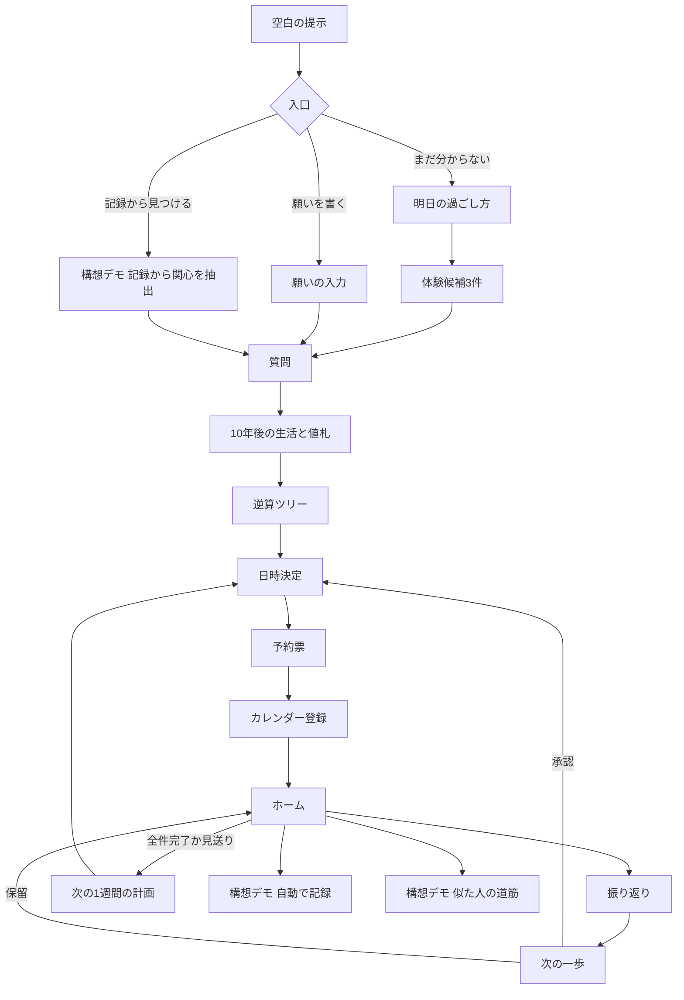

# リザーブマシン — 正式仕様・全機能実装計画

| 項目 | 内容 |
| --- | --- |
| 作成日 | 2026年9月13日 |
| 状態 | **正式採用。** 2026年9月13日、ユーザーの「proposal2を正式版にします」という指示により採用。実装完了を意味しない |
| 採用元 | `mvp-proposal2.md`（Gitコミット `219b520`）。元の提案書は保存 |
| 元にした版 | A案（`member-a.md`）、B案 v0.2（`member-b.md`）、C案 v0.3（`member-c.md`） |
| `mvp-proposal.md` との関係 | 縮小案は比較資料として保存。正式な開発基準は本書。機能範囲と作る順番はproposal2を引き継ぐ |

---

## 1. この計画の方針

### 1.1 3つのルール

1. **3案の間で矛盾しない機能は、すべて実装対象にする。** 矛盾する点は第3章で解消方法を決める。
2. **時間を理由に機能を削らない。** 作る順番（第11章）だけを決め、順番どおりに進める。最後まで動かせなかった機能は、消さずにモックとして画面に残す。
3. **モックは、モックだと分かるように出す。** 画面に「サンプル」「構想デモ」と表示し、動いたように見せない。A案・B案に共通する原則「実際に行っていない手配を予約済みと表示しない」をモックにも適用する。

### 1.2 実装レベル

各機能は、次の4段階のどこまで作れたかで管理する。

| レベル | 状態 | 画面の表示 |
| --- | --- | --- |
| 本実装 | 実際の入力で動き、AIや外部サービスにもつながっている | 表示なし |
| 簡易実装 | 動くが、選択肢を固定する、手入力にするなど一部を簡略化している | 表示なし |
| モック | 固定のサンプルデータで画面と画面遷移だけ動く | 「サンプル」 |
| 構想デモ | 今回は動かす前提がなく、将来の姿をサンプルデータで見せる | 「構想デモ（実際のデータではありません）」 |

- 目標は全機能を「本実装」にすること。届かなければ「簡易実装」、それも無理なら「モック」に切り替える。
- 「構想デモ」は最初からモックで作る機能（第5章の G 群）。
- ただし、次の3つはモックにしない。偽物を出すと誤解を招くため、動かなければ機能ごと隠す。
  - Googleカレンダーへの登録成功の表示
  - 統計の参照値（統計の数値を作らない。未転記なら「AIの推定」と表示する）
  - 相談先の案内（リンク先を確認できなければ出さない）

### 1.3 `mvp-proposal.md` との違い

| 項目 | `mvp-proposal.md` | 本書 |
| --- | --- | --- |
| 基本方針 | B案を軸に範囲を縮小 | 3案の機能を原則すべて入れる |
| 質問 | 固定3問 | AIが作る質問＋固定質問 |
| 逆算ツリー・数字・統計 | 見送り | 実装する |
| 10年後の生活と値札（C案） | 費用目安だけ | 実装する |
| 空白の提示（C案） | なし | 実装する |
| 現在の予約 | 1件 | 最大3件（A案・B案） |
| カレンダー | 追加画面のリンクだけ | リンク、予定ファイル、API登録の3方式 |
| 将来の構想（自動判定・最短ルート・記録からの関心抽出） | なし | 構想デモとして画面に入れる |
| 時間の扱い | 150分の配分表 | 時間で削らず、作る順番だけ決める |

---

## 2. コンセプトと対象者

### 2.1 3案の価値を1本にする

3案の価値は、見ている時間の長さが違うだけで、ぶつからない。本書では3つを上から下へ重ねる。

| 時間 | 見せるもの | 出典 |
| --- | --- | --- |
| 10年後 | 空白が来る。その時間で続けていたい生活と、その値札（初期費用・月額・週の時間） | C案 §3・§8 |
| 1年後・3年後 | 目指す状態と、そのために必要な数字 | B案 FR-03・FR-04 |
| 今週 | 最大3件の行動を日時つきでカレンダーに入れる | B案 FR-07・FR-08、A案 ② |
| 明日 | 予約票と「始める言葉」「気が重いときは」で、明日を少し楽しみにする | A案 ②・§5 |
| その後 | 結果と気持ちを記録し、次の一歩を一緒に決める | A案 ③、B案 FR-10・FR-11 |

### 2.2 キャッチコピーの候補

発表で使う一言は、チームで1つ選ぶ。

| 候補 | 出典 |
| --- | --- |
| 仕事がなくても、明日が楽しみになる。 | A案 |
| 曖昧な願いを、今日の予定に変える。 | B案 |
| 空白が来る前に、10年後の楽しみを予約する。 | 3案を合わせた案（本書） |

### 2.3 対象者

- 定義はC案 §4.1 を使う。**外から空白が降ってくる人。** やる気がないのではなく、やる気を仕事に吸われていて、空白を感じたことがない。
- 空白の降り方（AIが仕事を減らす／週休3日／定年／就活の終了）は、アプリの「空白の提示」の選択肢としてそのまま実装する（F-02）。
- C案 v0.3 で入力がテキストと選択肢になり、どのペルソナでも成立するようになった（C案 §4.2）。そのため、3案のペルソナを全員デモデータとして用意する（F-40）。

| デモの人物（架空） | 出典 | 主に見せる入口 |
| --- | --- | --- |
| 佐藤さん 48歳・事務職。趣味がなく、何をしたいか分からない | A案 §2 | まだ分からない → 明日の過ごし方 → 体験候補 |
| けんたさん 32歳・事務職。「このままじゃまずい気がする」 | B案 §4 | 願いを書く → 質問 → 逆算ツリー |
| 空白の降り方が「週休3日」の会社員 | C案 §4.1 | 空白の提示 → 10年後の値札 |

発表の主人公を誰にするかは、チームで決める（第17章）。

---

## 3. 矛盾点と解消方法

3案を読み比べて、そのままでは同時に入らない点と、その解消方法。

| # | 論点 | A案 | B案 | C案 v0.3 | 本書での解消 |
| --- | --- | --- | --- | --- | --- |
| 1 | 入口 | 「ある／見つけたい」の2つ。見つけたい人には明日の過ごし方を聞く | 1つの入力欄と質問で吸収 | B案と同じ。願いの前に空白を見せる | **3つとも入れる。** 最初に空白を見せ（C）、次に「願いを書く（B）」「まだ分からない（A）」を選ばせる。「やりたいことがある」はB案の入力に統合する |
| 2 | 逆算の到達点 | 明日の楽しみ | 1年後・3年後 | 10年後。C案 §11.1 では「両方は置けない」 | **階層を重ねて両方置く。** C案が両立しない理由は「4時間では組めない」という時間の制約で、仕様の矛盾ではない。本書は時間で削らないため、10年後の生活を最上段、1年後・3年後を次の段に置く |
| 3 | カレンダー | 認証・同期は作らない（.ics は余裕があれば） | テンプレートURLを必須、API登録は任意 | B案と同じ。OAuthを本命にしない | **テンプレートURLを本命にし、予定ファイルとAPI登録も作る。** API登録はA案・C案の懸念どおり本命にせず、動かなければ隠す |
| 4 | 数字の中心 | 数字を持たない。行動件数を点数にしない | 貯蓄目標型・頻度型 | 値札（初期費用・月額・週の時間） | **3種類の数字の型を持つ**（貯蓄目標型・頻度型・値札型）。行動件数を幸福度や達成率に換算しない点はA案に合わせる |
| 5 | 振り返りの項目 | 結果、気持ち、またやりたいか、一言 | 結果、気持ち（任意）、一言 | B案と同じ | **A案の項目をすべて使う。** B案の項目はA案に含まれる |
| 6 | 最初の予定 | 最大3件 | 最大3件 | 最初の1日 | **最大3件のうち1件に「最初の1日」の印を付ける** |
| 7 | 記録（視聴履歴など）からの関心抽出 | なし | 展開性 | v0.3で取り下げて展開性へ | **構想デモとして入れる。** C案が取り下げた理由（審査員が試せない・形式が未検証）は、サンプルデータで見せる構想デモなら当たらない |
| 8 | 値札の金額とA案の方針 | 実在施設の料金を作らない | 出どころを表示、投資助言をしない | 出どころを表示、資産形成の方法は出さない | **値札は目安として出し、出どころを必ず表示する。** 実在の施設名と料金は出さない |
| 9 | 反対役（「それでも予約しますか？」） | 責めない、強要しない | 記載なし | v0.2のオプション。v0.3では記載なし | **入れない。** 現行のC案に記載がなく、A案の方針とも衝突しやすい |
| 10 | 報酬設計 | なし | なし | 作らない | **入れない。** 3案とも作らない |

---

## 4. 全体の流れ



- 保存済みのデータがあれば、起動時はホームを開く。
- 空白の提示は「あとで見る」で飛ばせる。

---

## 5. 機能一覧

「出典」は元の案の該当箇所。「動かないとき」は、目標レベルに届かなかった場合の置き場所。担当は第12章。

### A群 入口と発見

| ID | 機能 | 出典 | 目標 | 動かないとき | 担当 |
| --- | --- | --- | --- | --- | --- |
| F-01 | 入口画面（空白の提示へ／入口の選択／デモを見る） | A §4、B S-01、C §6 | 本実装 | — | ② |
| F-02 | 空白の提示（空白の降り方を選ぶと、年・10年の日数と時間を計算して見せる） | C §3・§6 | 本実装 | 簡易実装（週休3日だけ） | ② |
| F-03 | 願いの入力（自由文、「まだ分からない」も可） | A ①、B FR-01、C §7 | 本実装 | — | ② |
| F-04 | 明日の過ごし方の選択（少し外に出たい／誰かと話したい／何か作ってみたい／ゆっくり休みたい／まだ分からない） | A ① | 本実装 | — | ② |
| F-05 | 体験候補3件（名前・提案理由・最初に試すこと・所要時間・費用の目安）と再提案 | A ①、`mvp-proposal.md` §4 | 本実装 | モック（固定の3候補） | ③ |
| F-06 | 逆算の質問（AIが作る質問＋固定質問、「分からない」と仮置き） | B FR-02、A ①、C §7 | 本実装 | 簡易実装（固定質問だけ） | ③ |

### B群 10年後と逆算

| ID | 機能 | 出典 | 目標 | 動かないとき | 担当 |
| --- | --- | --- | --- | --- | --- |
| F-07 | 10年後の生活（1行）と値札（初期費用・月額・週の時間） | C §6・§8 | 本実装 | モック（固定の値札） | ③ |
| F-08 | 逆算ツリー（10年後の生活 → 1年後・3年後の目指す状態 → 数字 → 月の行動 → 今週の行動） | B FR-03、C §3 | 本実装 | モック（固定のツリー） | ③ |
| F-09 | 数字の計算（貯蓄目標型・頻度型・値札型、コードで計算） | B FR-04、C §8 | 本実装 | — | ① |
| F-10 | 出どころの表示（本人の回答／統計の参照値／AIの推定、仮置きの「仮」） | B FR-05、C §8 | 本実装 | — | ① |
| F-11 | 統計の参照データ（一次資料から転記） | B §11 | 本実装 | 未転記の項目は「AIの推定」と表示 | ③ |
| F-12 | ツリーと値札の編集、再計算、行動の作り直し | B FR-06 | 本実装 | 簡易実装（編集のみ、作り直しなし） | ① |
| F-13 | 目指す状態と「自分がやりたい理由」の編集（理由は任意） | A ② | 本実装 | — | ② |

### C群 予約とカレンダー

| ID | 機能 | 出典 | 目標 | 動かないとき | 担当 |
| --- | --- | --- | --- | --- | --- |
| F-14 | 日時候補（コードで3つ）と手入力、過去日時の拒否、重なりの警告 | A ②、B FR-07 | 本実装 | 簡易実装（手入力だけ） | ① |
| F-15 | 予約票（予約番号・やりたいこと・理由・今回の一歩・日時・場所・準備・気が重いときは・始める言葉・10年後の生活・確保する空白・値札・最初の1日の印） | A §5、C §8 | 本実装 | — | ① |
| F-16 | カレンダー登録 方法B：テンプレートURLと「カレンダーに保存した」の本人確認 | B FR-08・§12.2、C §11.2 | 本実装 | — | ① |
| F-17 | カレンダー登録 方法C：予定ファイル（.ics） | A §8、B §12.3 | 本実装 | 隠す | ① |
| F-18 | カレンダー登録 方法A：Google Calendar API | B §12.1 | 本実装 | **隠す（モックにしない）** | ① |
| F-19 | 日時変更と見送り（APIで登録済みなら更新・削除の確認） | A ②、B FR-12 | 本実装 | 簡易実装（アプリ内だけ変更し、カレンダー側の変更を促す） | ① |

### D群 伴走

| ID | 機能 | 出典 | 目標 | 動かないとき | 担当 |
| --- | --- | --- | --- | --- | --- |
| F-20 | ホーム（次の楽しみ、今週の予定、確認待ち、楽しかった体験・またやりたいこと、今月の回数、ツリーの進み具合、10年後の生活1行） | A ②③、B FR-09、C §5 | 本実装 | — | ① |
| F-21 | 振り返り（できた／少しできた／できなかった、気持ち、またやりたいか、一言） | A ③、B FR-10 | 本実装 | — | ③ |
| F-22 | 次の一歩（次へ進む／小さくする／日を変える／休む／別の体験、承認・保留・別の案1回） | A ③、B FR-11 | 本実装 | モック（結果ごとに固定の案） | ③ |
| F-23 | 枠が満杯のときの置き換え（最大3件） | A ③、B FR-11 | 本実装 | — | ① |
| F-24 | 次の1週間の計画（全件完了・見送りで新しい計画、前の感想を引き継ぐ） | A ③ | 本実装 | モック（固定の次週案） | ③ |
| F-25 | 履歴（変更前後の予定、過去の計画と振り返り） | A §7、B §10 | 本実装 | 簡易実装（一覧表示のみ） | ① |

### E群 安全と基盤

| ID | 機能 | 出典 | 目標 | 動かないとき | 担当 |
| --- | --- | --- | --- | --- | --- |
| F-26 | 端末内の保存と復元、破損時の扱い | A §7、B FR-13 | 本実装 | — | ① |
| F-27 | 記録の全削除、新しい目標にするときの置き換え確認 | A §7、B FR-15 | 本実装 | — | ① |
| F-28 | AIの失敗時の動作（自動再試行1回、入力を残す、二重送信防止） | A §7、B FR-14 | 本実装 | — | ③ |
| F-29 | AI出力の形式検証 | A §7、B §9.5 | 本実装 | — | ③ |
| F-30 | 使わない表現の検査（人を評価する言葉、断言、強要） | A §1、B §13.1 | 本実装 | — | ③ |
| F-31 | 強い苦痛を示す入力のときの相談先の案内 | B FR-16・§13.3 | 本実装 | **隠す（モックにしない）** | ③ |
| F-32 | お金の話題のガードレール（投資商品・利回り・保証を出さない、目安の注記） | A §6、B §13.2、C §6 | 本実装 | — | ③ |
| F-33 | 送信と保存場所の注意書き | B S-01 | 本実装 | — | ② |

### F群 デモと設定

| ID | 機能 | 出典 | 目標 | 動かないとき | 担当 |
| --- | --- | --- | --- | --- | --- |
| F-34 | 設定（全削除、カレンダー接続の解除、デモデータの読み込み） | B FR-15 | 本実装 | — | ① |
| F-35 | 機能モード一覧（各機能が本実装・簡易実装・モック・構想デモのどれで動いているかを表示） | 本書で追加 | 本実装 | — | ① |
| F-36 | 体験アンケート（明日やってみたいと思えたか、負担なく始められそうか、また使いたいか） | A §10 | 簡易実装 | 隠す | ② |
| F-40 | デモデータ3人分と状態の切り替え（予約前／確認待ち／記録後／次週） | A §10、B §17.2 | 本実装 | — | ② |

### G群 構想デモ（最初からサンプルデータで作る）

| ID | 機能 | 出典 | 目標 | 画面で見せること | 担当 |
| --- | --- | --- | --- | --- | --- |
| F-37 | 記録から関心を見つける | C v0.2 §7・§9、C v0.3 §12 | 構想デモ | 視聴履歴の集計例 → 「頼まれてもいないのに見ているもの」→ 願いの候補 → 質問へ合流 | ③ |
| F-38 | 端末のデータで自動で記録する | B §20 第2段階 | 構想デモ | 「予定の場所に60分いました（サンプル）」→「できた、で記録しますか？」→ 承認で記録 | ② |
| F-39 | 似た出発点の人の道筋から次の一歩を提案する | B §20 第3段階 | 構想デモ | 「似た出発点の人がたどった順番（サンプル。実在の利用者ではありません）」→ 次の一歩の候補に追加 | ③ |

- F-37 は、余力があればGoogleテイクアウトのファイルを読む本実装に上げてよい。その場合はC案 v0.2 §13 の未検証事項（ファイル形式、流入経路が分かるか）を先に確かめる（Q-06）。
- G群は、実データを使わない。承認した結果（F-38 の記録、F-39 の提案）は、デモデータにだけ書き込む。

---

## 6. 機能の詳細（統合で決めた点）

各機能の細かい動作は元の案に書いてある。ここには、3案を合わせたときに新しく決めたことだけを書く。

### 6.1 空白の提示（F-02）

- 空白の降り方を選ぶ：AIが仕事を減らした／週休3日になった／定年を迎える／就活が終わった／その他。
- 週休3日は、C案 §6 の計算を使う：年52日、10年で520日、1日8時間換算で4,160時間。
- それ以外は、「1週間に増える自由な時間」を本人が入力し、コードで年と10年の時間に換算する。
- 表示する数字の出どころは「制度からの計算」または「本人の回答」。
- ここで出す時間を、そのまま日時候補には使わない。日時候補は「使える曜日と時間帯」の質問（F-06）で決める（`mvp-proposal.md` §3 の注意と同じ）。

### 6.2 入口と質問の合流（F-03〜F-06）

- 「願いを書く」：B案 FR-01・FR-02 のとおり。
- 「まだ分からない」：A案 ① のとおり、明日の過ごし方 → 時間と予算 → 体験候補3件。選んだ体験を「願い」として扱い、F-06 の質問に進む。
- 「記録から見つける」：構想デモ（F-37）。選んだ関心を「願い」として扱い、F-06 に進む。
- 質問は、AIが作る質問（最大5問）に、次の固定質問を足す。重複する質問はAI側に作らせない。

| 固定質問 | 出典 | 使い道 |
| --- | --- | --- |
| 使える曜日と時間帯 | B FR-02 | 日時候補 |
| 1回に使える時間 | A ①、C §8 | 値札の週の時間、行動の所要時間 |
| 使える予算 | A ① | 値札、体験候補 |
| 経験（初期値は未経験） | A ① | 行動の粒度 |
| この半年で、頼まれてもいないのに時間を使ったこと | C §7 の提案 | 10年後の生活の手がかり |

### 6.3 10年後の生活と値札（F-07）

- 10年後の生活は1行（例：「週3日、陶芸をしている」）。出どころは「AIの推定」。
- 値札は3項目。

| 項目 | 出どころ | 計算 |
| --- | --- | --- |
| 初期費用 | 統計の参照値、なければAIの推定 | AIは金額の案と出どころを返す。表示はコードで整える |
| 月額 | 統計の参照値、なければAIの推定 | 同上 |
| 週の時間 | 本人の回答 | 1回の時間 × 週の回数（頻度型と同じ計算） |

- 実在の施設名・料金は出さない。「目安です。実際の費用は確かめてください」を値札の下に表示する。
- 本人が値札を編集すると、出どころは「本人の回答」に変わる（F-12）。
- 予約票とカレンダーの説明欄に、値札を書き込む（C案 §8）。

### 6.4 逆算ツリーの段（F-08）

| 段 | 内容 | 件数 |
| --- | --- | --- |
| 10年後の生活 | F-07 | 1 |
| 目指す状態 | 1年後と3年後 | 各1 |
| 数字 | 貯蓄目標型・頻度型・値札型 | 1〜3 |
| 月の行動 | 今月やること | 1〜3 |
| 今週の行動 | 日時を決めてカレンダーに入れる単位 | 最大3。うち1件に「最初の1日」の印 |

- 「最初の1日」は、今週の行動のうち最も早い日時の行動に自動で付け、本人が付け替えられる。
- 行動件数を、10年後の生活の達成率や点数に換算しない（A案 §3）。

### 6.5 予約票（F-15）

A案 §5 の項目に、C案 §8 の項目を足す。

| 項目 | 出典 |
| --- | --- |
| 予約番号、やりたいこと、自分の理由、今回の一歩、日時・所要時間、場所、準備、気が重いときは、始める言葉 | A案 §5 |
| 10年後の生活、確保する空白、初期費用、月額、週の時間、最初の1日の印 | C案 §8 |
| 各数字の出どころ | B案 FR-05、C案 §8 |
| カレンダーの登録状態とリンク | B案 FR-08 |

### 6.6 振り返りと次の一歩（F-21〜F-24）

- 項目はA案 ③ をすべて使う。結果は必須、ほかは任意。
- 次の一歩の種類は、B案の4種類（次へ進む・小さくする・日を変える・休む）に、A案の「別の体験を試す」を足した5種類。
- 「またやりたい」「楽しかった」はホームに残し、次の一歩の手がかりにする（A案 ③）。
- 「できなかった」「しんどかった」のときは「次へ進む」を出さない（B案 FR-11）。
- 承認前は、行動・日時・カレンダーのどれも変えない（A案・B案共通）。
- 構想デモ F-39 の提案は、次の一歩の「別の案」の1つとして並べる。サンプルであることを表示する。

---

## 7. 画面一覧

| ID | 画面 | 主な機能 | 出典 |
| --- | --- | --- | --- |
| S-01 | 空白の提示 | F-02 | C |
| S-02 | 入口 | F-01、F-33 | A・B |
| S-03 | 願いの入力 | F-03 | B |
| S-04 | 明日の過ごし方 | F-04 | A |
| S-05 | 体験候補 | F-05 | A |
| S-06 | 質問 | F-06 | B・A・C |
| S-07 | 10年後の生活と値札 | F-07、F-10 | C |
| S-08 | 逆算ツリー | F-08〜F-13 | B |
| S-09 | 日時決定 | F-14 | A・B |
| S-10 | 予約票 | F-15 | A・C |
| S-11 | カレンダー登録 | F-16〜F-18 | B |
| S-12 | ホーム | F-20 | A・B |
| S-13 | 振り返り | F-21 | A |
| S-14 | 次の一歩 | F-22、F-23 | A・B |
| S-15 | 次の1週間の計画 | F-24 | A |
| S-16 | 履歴 | F-25 | A・B |
| S-17 | 設定 | F-27、F-34、F-35 | B・本書 |
| S-18 | 相談先の案内 | F-31 | B |
| S-19 | 体験アンケート | F-36 | A |
| G-01 | 構想デモ：記録から関心を見つける | F-37 | C |
| G-02 | 構想デモ：自動で記録する | F-38 | B |
| G-03 | 構想デモ：似た人の道筋 | F-39 | B |

- 各画面の表示項目・ボタン・エラー文言は、B案 §8 を基本にし、A案 §4 の表示内容を足す。
- 全画面、スマホ幅360pxで横スクロールなしに操作できる（B案 NFR-02）。
- G-01〜G-03 は画面上部に「構想デモ（実際のデータではありません）」の帯を固定表示する。

---

## 8. AI呼び出し一覧

AIの呼び出しはサーバー側で行い、キーをブラウザに置かない（3案共通）。計算・日時候補・検証はコードで行う（B案 §9.1）。

| ID | 役割 | 入力 | 出力 | 出典 | モック応答 |
| --- | --- | --- | --- | --- | --- |
| AI-01 | 質問を作る | 願い、固定質問の一覧 | 願いの種類、質問（最大5問） | B AI-01 | `mocks/ai/questions.json` |
| AI-02 | 体験候補を作る | 明日の過ごし方、時間、予算、経験 | 候補3件（名前・理由・最初に試すこと・所要時間・費用の目安） | A ① | `mocks/ai/candidates.json` |
| AI-03 | 10年後の生活・値札・逆算ツリーを作る | 願い、回答、空白、統計の項目ID一覧 | 10年後の生活、値札の案、目指す状態、数字の型と入力値、月の行動、今週の行動 | B AI-02、C §8 | `mocks/ai/tree.json` |
| AI-04 | 次の一歩を作る | 目指す状態、行動、振り返り、直近5件の記録 | 次の一歩1件（種類・内容・理由・言葉） | B AI-03、A ③ | `mocks/ai/next-step.json` |
| AI-05 | 次の1週間の計画を作る | 目指す状態、前の計画の結果と感想 | 今週の行動最大3件 | A ③ | `mocks/ai/next-week.json` |
| AI-06 | 記録から関心を見つける | 集計済みのサンプル（上位の件数だけ） | 関心の候補3件と根拠 | C v0.2 §9 | 構想デモでは常にモック |

- どの応答にも「強い苦痛を示す入力か」の判定を含める（F-31）。
- 出力の検証はB案 §9.5 を使い、値札（初期費用・月額は0以上の整数、週の時間は0より大きく168以下）を足す。
- 出力品質の確認は、B案 §9.7 の5件に「まだ分からない → 少し外に出たい」「週休3日 → 何かしたい」の2件を足した7件で行う。

---

## 9. データ形式

保存はブラウザのローカル保存領域。キーは `reserve-machine:v2`。A案 §7 とB案 §10 のデータを合わせ、C案の項目を足す。

```json
{
  "schemaVersion": 2,
  "isDemo": false,
  "demoPersona": null,
  "blank": {
    "type": "four_day_week",
    "hoursPerWeek": 8,
    "daysPerYear": 52,
    "hoursPer10Years": 4160,
    "source": "policy_calc"
  },
  "entry": { "type": "wish" },
  "discovery": {
    "tomorrowMood": null,
    "candidates": [],
    "selectedCandidateId": null
  },
  "wish": {
    "id": "wish_01",
    "text": "なんか、このままじゃまずい気がする",
    "reason": null,
    "category": "activity",
    "createdAt": "2026-09-13T20:10:00+09:00"
  },
  "answers": [
    { "questionId": "fixed_slots", "value": ["holiday_morning"], "isUnknown": false }
  ],
  "futureLife": {
    "text": "週3日、陶芸をしている",
    "priceTag": {
      "initialCost": { "value": 50000, "source": "ai_estimate", "statId": null },
      "monthlyCost": { "value": 10000, "source": "ai_estimate", "statId": null },
      "weeklyHours": { "value": 9, "source": "user" }
    }
  },
  "tree": {
    "goals": [
      { "horizon": "1y", "text": "…", "deadline": "2027-09" },
      { "horizon": "3y", "text": "…", "deadline": "2029-09" }
    ],
    "metrics": [],
    "monthly": []
  },
  "plans": [
    { "id": "plan_01", "startedAt": "…", "closedAt": null, "actionIds": ["act_01"] }
  ],
  "actions": [
    {
      "id": "act_01",
      "planId": "plan_01",
      "title": "陶芸体験の空きを調べる",
      "durationMin": 30,
      "place": "自宅",
      "prep": ["スマートフォン"],
      "fallback": "教室の名前を検索するだけでもOK",
      "startMessage": "申し込まなくて大丈夫。見るだけ。",
      "reservationNo": "RM-20260913-001",
      "isFirstDay": true,
      "status": "registered",
      "start": "2026-09-19T10:00:00+09:00",
      "end": "2026-09-19T10:30:00+09:00",
      "calendar": { "method": "template", "eventId": null, "confirmedAt": "…" },
      "origin": "tree"
    }
  ],
  "records": [
    {
      "id": "rec_01",
      "actionId": "act_01",
      "result": "not_done",
      "feeling": "tired",
      "again": "no_answer",
      "memo": "",
      "recordedAt": "…"
    }
  ],
  "proposals": [],
  "history": [],
  "survey": null
}
```

- 上の金額や時間はデモ用の架空の値。
- `blank.source` は `policy_calc`（制度からの計算）か `user`（本人の回答）。
- `entry.type` は `wish` / `unknown` / `records_demo`。
- `records.again` は `again` / `other` / `unknown` / `no_answer`（A案 ③）。
- `metrics.kind` は `saving` / `frequency` / `price` / `note`。
- 行動の状態はB案 §10.4 を使う。
- デモデータで動いているとき（`isDemo: true`）は、画面に「デモ用」と表示し続ける。

---

## 10. モックの作り方

### 10.1 機能モードの切り替え

- 機能ごとに `real`（本実装）/ `simple`（簡易実装）/ `mock`（モック）/ `concept`（構想デモ）/ `off`（隠す）を1か所の設定ファイルで持つ。
- 画面はこの設定を読んで、表示と「サンプル」の帯を切り替える。
- 設定画面の機能モード一覧（F-35）に、全機能の現在のモードを表示する。発表前にここを見れば、何が本物で何がモックかをチーム全員が同じように説明できる。

### 10.2 AIのモック

- サーバーの環境変数でAIを `mock` にすると、AI-01〜06 は `mocks/ai/` の固定JSONを返す。
- 最初はすべてモックで画面をつなぎ、AIを1つずつ本物に置き換える（A案 §11 の「固定サンプルデータで画面をつなぎ、その後AI処理に置き換える」と同じ）。
- 本物のAIが失敗し続けるときにモックへ自動で切り替えることはしない。偽の結果を本物として見せないため、失敗時はF-28 のとおり再試行を出す。

### 10.3 サンプルデータ

- デモデータは3人分（第2.3節）× 4状態（予約前／確認待ち／記録後／次週）を `demo/` に置く。
- 構想デモのサンプルは `mocks/concept/` に置き、ファイルの先頭にも「実在の利用者・実データではない」と書く。

---

## 11. 作る順番

時間で削らない。上から順に作り、Waveが終わるたびにmainへ入れて公開URLで一巡を確認する。途中で止まった機能は、モードを `mock` か `off` にしてから次へ進む。

| Wave | 作るもの | 終わったときの状態 |
| --- | --- | --- |
| W0 土台 | 技術の決定、雛形、共通の型、機能モード（F-35）、AIのモック、デモデータ1人分、公開URL | 3人が同じURLを開ける |
| W1 中心の一巡（モックで） | S-02 入口 → S-03 願い → S-06 質問 → S-08 ツリー → S-09 日時の手入力 → S-10 予約票 → S-11 方法B → S-12 ホーム → S-13 振り返り → S-14 次の一歩、保存（F-26） | モックAIで一巡が通る。**ここで発表できる状態** |
| W2 AIを本物に | AI-01、AI-03、AI-04、形式検証（F-29）、失敗時（F-28）、表現の検査（F-30）、お金のガードレール（F-32） | 実際の入力で一巡が通る |
| W3 入口をそろえる | S-01 空白の提示（F-02）、S-04 明日の過ごし方、S-05 体験候補（AI-02）、固定質問、注意書き（F-33） | 3つの入口から質問に合流する |
| W4 10年後と数字 | S-07 10年後の生活と値札（F-07）、数字の計算（F-09）、出どころ（F-10）、統計の転記（F-11）、編集と再計算（F-12・F-13）、予約票への値札（F-15） | 10年後から今週までが1本につながる |
| W5 伴走を厚く | 日時候補（F-14）、日時変更と見送り（F-19）、置き換え（F-23）、次の1週間（F-24・AI-05）、履歴（F-25）、相談先（F-31）、全削除と置き換え確認（F-27） | 記録から次の週まで続けられる |
| W6 カレンダーを厚く | 予定ファイル（F-17）、API登録（F-18） | 3方式から選べる |
| W7 構想デモ | G-01（F-37）、G-02（F-38）、G-03（F-39） | 展開性を画面で見せられる |
| W8 仕上げ | デモデータ3人分と状態切り替え（F-40）、設定（F-34）、体験アンケート（F-36）、スマホ幅の確認 | 発表と動画の素材がそろう |

- 発表資料と動画は、W1が終わった時点から並行して作り始める。Waveが進むたびに差し替える。
- 提出の締め切りだけは守る。締め切りから逆算して「機能追加を止める時刻」を1つ決め、その時刻に到達したWaveで提出する（Q-08）。
- W6 の API登録（F-18）は、OAuthの準備（B案 Q-03）ができていなければ、W8の後に回す。

---

## 12. 担当

`mvp-proposal.md` §7 の分担を広げた案。実際の割り当ては3人で決める。

| 担当 | 作るもの | 発表・提出 |
| --- | --- | --- |
| ① 予約・保存・公開 | 数字の計算、出どころ、編集、日時、予約票、カレンダー3方式、ホーム、置き換え、履歴、保存、設定、機能モード、デプロイ | 動作確認、提出の取りまとめ |
| ② 入口・発見・画面 | 空白の提示、入口、願い、明日の過ごし方、目指す状態と理由の編集、注意書き、体験アンケート、デモデータ、構想デモ G-02、画面の文言 | 企画の判断、発表資料、登壇 |
| ③ AI・伴走 | AI-01〜06、形式検証、表現の検査、お金のガードレール、相談先、体験候補、10年後の値札、逆算ツリー、統計の転記、振り返り、次の一歩、次の1週間、構想デモ G-01・G-03 | 紹介動画 |

- ③の量が多いため、W4 以降で統計の転記と構想デモのサンプル作りを②に移す。
- 同じファイルを同時に触らないよう、担当ごとにフォルダを分ける（第13章）。

---

## 13. ディレクトリ案

技術が決まったら確定する。

```text
src/
  features/
    blank/          # ② 空白の提示
    entry/          # ② 入口・願い・明日の過ごし方
    discovery/      # ③ 体験候補
    questions/      # ② 画面 ／ ③ AI
    future/         # ③ 10年後の生活と値札
    tree/           # ① 計算・編集 ／ ③ 生成
    reservation/    # ① 日時・予約票
    calendar/       # ① 方法A・B・C
    home/           # ① ホーム・履歴
    reflection/     # ③ 振り返り・次の一歩・次の1週間
    safety/         # ③ 表現の検査・相談先
    settings/       # ① 設定・機能モード
    concept/        # ②③ 構想デモ
  server/ai/        # ③ AI呼び出しと検証
  shared/types/     # 共通の型。W0で3人で確定
  shared/ui/        # 共通の部品
  config/features   # 機能モードの設定
mocks/
  ai/               # AIのモック応答
  concept/          # 構想デモのサンプル
demo/               # デモデータ（3人×4状態）
data/stats/         # 統計の参照データ
docs/presentation/  # 発表資料
```

---

## 14. 完成条件

### 14.1 全体の条件

- 公開URLで、スマホ幅でも、W1の一巡が通る。
- 機能モード一覧に、全機能のモードが正しく表示される。
- 「サンプル」「構想デモ」「デモ用」の表示が、該当する画面すべてに出ている。
- カレンダーに実際に入っていない予定を「登録済み」と表示しない。
- 統計の数値を作っていない。未転記の項目は「AIの推定」と表示されている。
- 画面・AI出力・発表資料・動画に、人を評価する言葉（B案 §13.1）が出てこない。
- 発表と動画の説明が、機能モード一覧の内容と一致している。

### 14.2 機能ごとの受入テスト

- A案 §9 の完成条件をすべて使う。
- B案 §16 の受入テスト TC-01〜TC-30 をすべて使う。
- 本書で次の7件を足す。

| ID | 手順 | 期待結果 |
| --- | --- | --- |
| P2-01 | 空白の提示で「週休3日」を選ぶ | 年52日、10年で520日、4,160時間が表示され、出どころが「制度からの計算」になる |
| P2-02 | 空白の提示で「その他」、週5時間と入力 | 年260時間、10年で2,600時間が表示される |
| P2-03 | 「まだ分からない」から体験候補を1つ選ぶ | 選んだ体験が願いとして質問画面に引き継がれる |
| P2-04 | 10年後の値札を表示 | 初期費用・月額・週の時間それぞれに出どころが表示され、「目安です」の注記が出る |
| P2-05 | 値札の月額を編集 | 出どころが「本人の回答」に変わり、予約票の値札も変わる |
| P2-06 | 今週の行動が3件ある状態で予約票を見る | 最も早い行動に「最初の1日」の印が付き、付け替えられる |
| P2-07 | 構想デモ G-02 で「できた、で記録」を承認 | デモデータにだけ記録され、帯に「構想デモ」が出続ける。本人のデータは変わらない |

---

## 15. デモと発表の流れ

発表の主人公はチームで決める（Q-01）。以下は機能をすべて見せる場合の順番。

1. **空白**：「週休3日になった。年52日、10年で4,160時間の空白が来る」（S-01）
2. **願い**：「なんか、このままじゃまずい気がする。何かしたい」（S-03）。別の入口として「まだ分からない」から体験候補が出る様子を5秒見せる（S-04・S-05）
3. **質問**：「頼まれてもいないのに時間を使ったこと」などに答える。1問は「分からない」にして「仮」を見せる（S-06）
4. **10年後の値札**：「週3日、陶芸をしている。初期費用・月額・週9時間」と出どころ（S-07）
5. **逆算ツリー**：10年後から今週の行動まで。期限を変えて数字が再計算される（S-08）
6. **予約票とカレンダー**：「最初の1日」の予約票を発券し、Googleカレンダーに入った画面（S-10・S-11）
7. **できなかった日**：デモデータを「確認待ち」に切り替え、「できなかった・しんどかった」を記録。小さな次の一歩を承認して、翌日の予定に入る（S-13・S-14）
8. **構想デモ（30秒）**：自動で記録される未来（G-02）と、似た人の道筋（G-03）。「構想デモです」と口頭でも伝える
9. **締め**：キャッチコピー（第2.2節から選んだもの）

- 第1〜7は本実装かモックかにかかわらず見せる。モックの箇所は機能モード一覧に合わせて説明する。
- AIの出力は毎回変わるため、動画はデモデータと実際の生成の両方を撮っておく（B案 §17.2）。

---

## 16. 展開性

B案 §20 とC案 §4.1 を合わせる。本書では、第2・第3段階の姿を構想デモとして画面に入れる。

| 段階 | 内容 | 今回の画面 |
| --- | --- | --- |
| 第1段階（今回） | 空白の提示、10年後の値札、逆算、カレンダー、振り返り | 本実装 |
| 第2段階 | 本人がオンにした範囲で、端末のデータから自動で記録する。判定は端末内で行う | G-02 構想デモ |
| 第2段階 | 本人が選んだ記録（視聴履歴など）から、言葉にしていない関心を見つける | G-01 構想デモ |
| 第3段階 | 匿名化した「出発点 → 行動 → 記録」から、似た人の道筋を次の一歩として提案する | G-03 構想デモ |
| 対象の広がり | AIによる業務の減少 → 週休3日 → 定年 → 就活の終了と、空白の降り方ごとに対象が増える | S-01 の選択肢 |

行動データの扱いは「本人がオンにした範囲だけ」「端末内で判定」「目的外に使わない」の3点を固定する（B案 §20）。

---

## 17. 未決事項・未検証事項

| ID | 内容 | 決める人・確かめ方 |
| --- | --- | --- |
| Q-01 | 発表の主人公（佐藤さん／けんたさん／週休3日の会社員）とキャッチコピー | チームで決める |
| Q-02（決定済み） | proposal2を正式仕様として採用 | 2026年9月13日のユーザー指示 |
| Q-03 | 使用技術、AIサービスとモデル、デプロイ先 | チームで決める |
| Q-04 | 10年後の金額がAIの推定に寄りすぎないか（C案 §11.1 の懸念） | AI-03 を7件の入力で試し、出どころの内訳を見る |
| Q-05 | 未審査のOAuthアプリでカレンダーAPIを使えるか | B案 Q-03 のとおり確認 |
| Q-06 | 構想デモ G-01 を本実装に上げる場合の、テイクアウトのファイル形式 | C案 v0.2 §13 の項目を公式情報で確認 |
| Q-07 | 統計の参照値の転記（項目・最新年・区分） | B案 §11 のとおり一次資料から転記 |
| Q-08 | 提出の締め切り、動画の長さと形式、機能追加を止める時刻 | 大会の案内を確認 |
| Q-09 | 担当の割り当てと、③の作業量の分け方 | チームで決める |

---

## 18. チーム決定欄

- 計画として採用する案：proposal2（正式採用済み）。本ファイルを開発基準とする。
- 発表の主人公とキャッチコピー：未決定
- 使用技術・AIサービス・デプロイ先：未決定
- 担当：未決定
- 機能追加を止める時刻：未決定

残る未決事項は決定後に本書へ反映する。個人案と元の `mvp-proposal2.md` は保存する。採用理由：ユーザーが全機能実装計画proposal2を正式版として指定したため。機能の採用・見送り理由は第3章・第5章を引き継ぐ。
